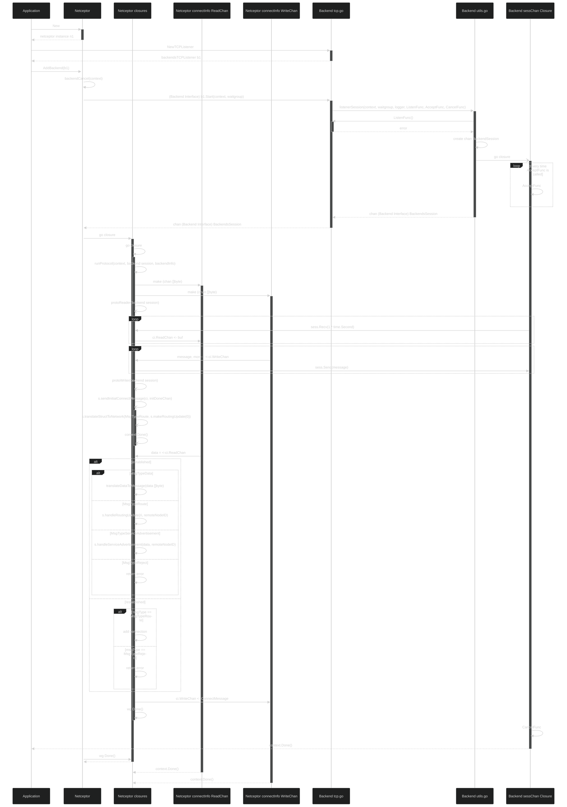

```mermaid
%%{init: { 'theme':'dark', 'sequence': {'useMaxWidth':false}, 'fontSize': 14 } }%%
sequenceDiagram
    participant Application
    participant Netceptor
    participant Netceptor closures
    participant Netceptor connectInfo ReadChan
    participant Netceptor connectInfo WriteChan
    Application->>+Netceptor: New
    Netceptor-->>-Application: netceptor instance n1
    Application->>+Backend tcp.go: NewTCPListener
    Backend tcp.go-->>-Application: backendsTCPListener b1
    Application->>+Netceptor: AddBackend(b1)
    Netceptor->>Netceptor: backendCancel(context)
    Netceptor->>+Backend tcp.go:(Backend Interface) b1.Start(context, waitgroup)
    Backend tcp.go->>+Backend utils.go:listenerSession(context, waitgroup, logger, ListenFunc, AcceptFunc, CancelFunc)
    Backend utils.go->>+Backend tcp.go:ListenFunc()
    Backend tcp.go-->>-Backend utils.go:error
    Backend utils.go->>Backend utils.go:create chan BackendSession
    Backend utils.go-)+Backend sessChan Closure:go closure
    loop Every time AcceptFunc is called
        Backend sessChan Closure->>Backend sessChan Closure:AcceptFunc
    end
    
    Backend utils.go-->>-Backend tcp.go:chan (Backend Interface) BackendsSession
    Backend tcp.go-->>-Netceptor: chan (Backend Interface) BackendsSession
    Netceptor->>+Netceptor closures: go closure
    Netceptor closures->>+Netceptor closures: go closure
    Netceptor closures->>Netceptor closures: runProtocol(context, backend session, backendInfo)
    Netceptor closures->>+Netceptor connectInfo ReadChan: make (chan []byte)
    Netceptor closures->>+Netceptor connectInfo WriteChan: make (chan []byte)
    Netceptor closures-)Netceptor closures: protoReader(backend session)
    loop 
        Backend sessChan Closure->>Netceptor closures: sess.Recv(1 * time.Second)
        Netceptor closures->>Netceptor connectInfo ReadChan: ci.ReadChan <- buf
    end
    loop 
        Netceptor connectInfo WriteChan->>Netceptor closures: message, more = <-ci.WriteChan
        Netceptor closures->>Backend sessChan Closure: sess.Send(message)
    end
    Netceptor closures-)Netceptor closures: protoWriter(backend session)
    Netceptor closures-)+Netceptor closures: s.sendInitialConnectMessage(ci, initDoneChan)
    Netceptor closures-)Netceptor closures: s.translateStructToNetwork(MsgTypeRoute, s.makeRoutingUpdate(0))
    Netceptor closures-)-Netceptor closures: context.Done()
    Netceptor connectInfo ReadChan->>Netceptor closures: data = <-ci.ReadChan
    alt established
        alt MsgTypeData
            Netceptor closures->>Netceptor closures: translateDataToMessage(data []byte)
        else MsgTypeRoute
            Netceptor closures->>Netceptor closures: s.handleRoutingUpdate(ri, remoteNodeID)
        else MsgTypeServiceAdvertisement
            Netceptor closures->>Netceptor closures: s.handleServiceAdvertisement(data, remoteNodeID)
        else MsgTypeReject
            Netceptor closures->>Netceptor closures: return error
        end
    else !established
        alt msgType == MsgTypeRoute
            Netceptor closures->>Netceptor closures: add connection
        else msgType == MsgTypeReject
            Netceptor closures->>Netceptor closures: return error
        end
    end
    
    Netceptor closures->>Netceptor connectInfo WriteChan: ci.WriteChan <- ConnectMessage
    Netceptor closures->>-Netceptor closures: wg Done()
    Backend sessChan Closure->>Backend sessChan Closure:CancelFunc
    Backend sessChan Closure-->>-Application:context.Done()
    Netceptor->>Netceptor closures: wg Done()
    Netceptor closures-->>-Netceptor: 
    Netceptor connectInfo ReadChan-->>-Netceptor closures: context.Done()
    Netceptor connectInfo WriteChan-->>-Netceptor closures: context.Done()

```

