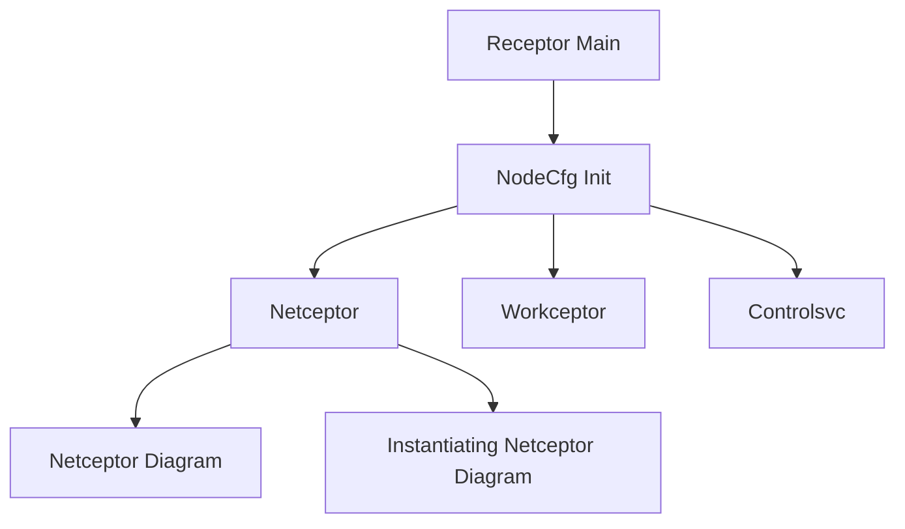

```mermaid
flowchart TD
Main[Receptor Main] --> NodeCfgInit[NodeCfg Init] 
NodeCfgInit --> Netceptor[Netceptor]
NodeCfgInit --> Workceptor[Workceptor]
NodeCfgInit --> Controlsvc[Controlsvc]
Netceptor --> NetceptorDiagram[Netceptor Diagram]
Netceptor --> InstantiatingNetceptor[Instantiating Netceptor Diagram]

click Main "https://github.com/ansible/receptor/blob/devel/cmd/receptor-cl/receptor.go#L49" _blank
click NodeCfgInit "https://github.com/ansible/receptor/blob/devel/pkg/types/main.go#L21" _blank
click Netceptor "https://github.com/ansible/receptor/blob/devel/pkg/netceptor/netceptor.go#L385" _blank
click Controlsvc "https://github.com/ansible/receptor/blob/devel/pkg/controlsvc/controlsvc.go#L161" _blank
click Workceptor "https://github.com/ansible/receptor/blob/devel/pkg/workceptor/workceptor.go#L72" _blank

click NetceptorDiagram "https://github.com/ansible/receptor/blob/devel/docs/diagrams/Netceptor/Netceptor.md" _blank
click InstantiatingNetceptorDiagram "https://github.com/ansible/receptor/blob/devel/docs/diagrams/Netceptor/InstantiatingNetceptor.md" _blank

```