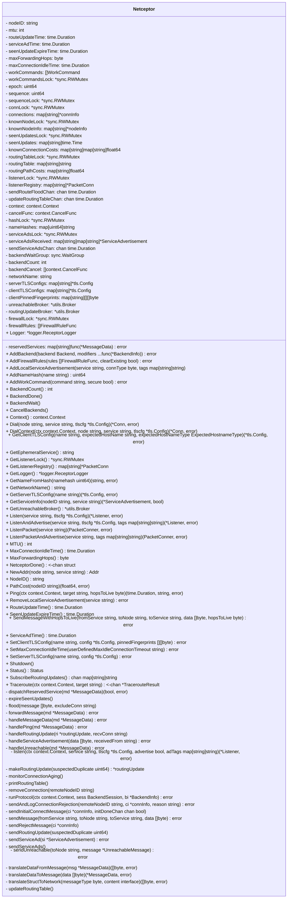

```mermaid
classDiagram
    class Netceptor {
        - nodeID:                   string
        - mtu:                      int
        - routeUpdateTime:          time.Duration
        - serviceAdTime:            time.Duration
        - seenUpdateExpireTime:     time.Duration
        - maxForwardingHops:        byte
        - maxConnectionIdleTime:    time.Duration
        - workCommands:             []WorkCommand
        - workCommandsLock:         *sync.RWMutex
        - epoch:                    uint64
        - sequence:                 uint64
        - sequenceLock:             *sync.RWMutex
        - connLock:                 *sync.RWMutex
        - connections:              map[string]*connInfo
        - knownNodeLock:            *sync.RWMutex
        - knownNodeInfo:            map[string]*nodeInfo
        - seenUpdatesLock:          *sync.RWMutex
        - seenUpdates:              map[string]time.Time
        - knownConnectionCosts:     map[string]map[string]float64
        - routingTableLock:         *sync.RWMutex
        - routingTable:             map[string]string
        - routingPathCosts:         map[string]float64
        - listenerLock:             *sync.RWMutex
        - listenerRegistry:         map[string]*PacketConn
        - sendRouteFloodChan:       chan time.Duration
        - updateRoutingTableChan:   chan time.Duration
        - context:                  context.Context
        - cancelFunc:               context.CancelFunc
        - hashLock:                 *sync.RWMutex
        - nameHashes:               map[uint64]string
        - reservedServices:         map[string]func(*MessageData) error
        - serviceAdsLock:           *sync.RWMutex
        - serviceAdsReceived:       map[string]map[string]*ServiceAdvertisement
        - sendServiceAdsChan:       chan time.Duration
        - backendWaitGroup:         sync.WaitGroup
        - backendCount:             int
        - backendCancel:            []context.CancelFunc
        - networkName:              string
        - serverTLSConfigs:         map[string]*tls.Config
        - clientTLSConfigs:         map[string]*tls.Config
        - clientPinnedFingerprints: map[string][][]byte
        - unreachableBroker:        *utils.Broker
        - routingUpdateBroker:      *utils.Broker
        - firewallLock:             *sync.RWMutex
        - firewallRules:            []FirewallRuleFunc
        + Logger:                   *logger.ReceptorLogger

        + AddBackend(backend Backend, modifiers ...func(*BackendInfo)) error
        + AddFirewallRules(rules []FirewallRuleFunc, clearExisting bool) error
        + AddLocalServiceAdvertisement(service string, connType byte, tags map[string]string)
        + AddNameHash(name string) uint64
        + AddWorkCommand(command string, secure bool) error
        + BackendCount() int
        + BackendDone()
        + BackendWait()
        + CancelBackends()
        + Context() context.Context
        + Dial(node string, service string, tlscfg *tls.Config) (*Conn, error)
        + DialContext(ctx context.Context, node string, service string, tlscfg *tls.Config) (*Conn, error)
        + GetClientTLSConfig(name string, expectedHostName string, expectedHostNameType ExpectedHostnameType) (*tls.Config, error)
        + GetEphemeralService() string
        + GetListenerLock() *sync.RWMutex
        + GetListenerRegistry() map[string]*PacketConn
        + GetLogger() *logger.ReceptorLogger
        + GetNameFromHash(namehash uint64) (string, error)
        + GetNetworkName() string
        + GetServerTLSConfig(name string) (*tls.Config, error)
        + GetServiceInfo(nodeID string, service string) (*ServiceAdvertisement, bool)
        + GetUnreachableBroker() *utils.Broker
        + Listen(service string, tlscfg *tls.Config) (*Listener, error)
        + ListenAndAdvertise(service string, tlscfg *tls.Config, tags map[string]string) (*Listener, error)
        + ListenPacket(service string) (PacketConner, error)
        + ListenPacketAndAdvertise(service string, tags map[string]string) (PacketConner, error)
        + MTU() int
        + MaxConnectionIdleTime() time.Duration
        + MaxForwardingHops() byte
        + NetceptorDone() <-chan struct
        + NewAddr(node string, service string) Addr
        + NodeID() string
        + PathCost(nodeID string) (float64, error)
        + Ping(ctx context.Context, target string, hopsToLive byte) (time.Duration, string, error)
        + RemoveLocalServiceAdvertisement(service string) error
        + RouteUpdateTime() time.Duration
        + SeenUpdateExpireTime() time.Duration
        + SendMessageWithHopsToLive(fromService string, toNode string, toService string, data []byte, hopsToLive byte) error
        + ServiceAdTime() time.Duration
        + SetClientTLSConfig(name string, config *tls.Config, pinnedFingerprints [][]byte) error
        + SetMaxConnectionIdleTime(userDefinedMaxIdleConnectionTimeout string) error
        + SetServerTLSConfig(name string, config *tls.Config) error
        + Shutdown()
        + Status() Status
        + SubscribeRoutingUpdates() chan map[string]string
        + Traceroute(ctx context.Context, target string) <-chan *TracerouteResult
        - dispatchReservedService(md *MessageData) (bool, error)
        - expireSeenUpdates()
        - flood(message []byte, excludeConn string)
        - forwardMessage(md *MessageData) error
        - handleMessageData(md *MessageData) error
        - handlePing(md *MessageData) error
        - handleRoutingUpdate(ri *routingUpdate, recvConn string)
        - handleServiceAdvertisement(data []byte, receivedFrom string) error
        - handleUnreachable(md *MessageData) error
        - listen(ctx context.Context, service string, tlscfg *tls.Config, advertise bool, adTags map[string]string) (*Listener, error)
        - makeRoutingUpdate(suspectedDuplicate uint64) *routingUpdate
        - monitorConnectionAging()
        - printRoutingTable()
        - removeConnection(remoteNodeID string)
        - runProtocol(ctx context.Context, sess BackendSession, bi *BackendInfo) error
        - sendAndLogConnectionRejection(remoteNodeID string, ci *connInfo, reason string) error
        - sendInitialConnectMessage(ci *connInfo, initDoneChan chan bool)
        - sendMessage(fromService string, toNode string, toService string, data []byte) error
        - sendRejectMessage(ci *connInfo)
        - sendRoutingUpdate(suspectedDuplicate uint64)
        - sendServiceAd(si *ServiceAdvertisement) error
        - sendServiceAds()
        - sendUnreachable(toNode string, message *UnreachableMessage) error
        - translateDataFromMessage(msg *MessageData) ([]byte, error)
        - translateDataToMessage(data []byte) (*MessageData, error)
        - translateStructToNetwork(messageType byte, content interface) ([]byte, error)
        - updateRoutingTable()
    }

```