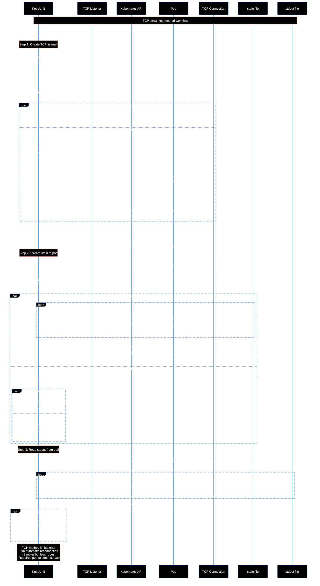

# Kubernetes Worker Workflow

This document provides comprehensive diagrams documenting the Kubernetes worker implementation in Receptor. The Kubernetes worker executes work units by creating and managing Kubernetes pods, with two different streaming methods for communication.

## Table of Contents

- [Kubernetes Worker Workflow](#kubernetes-worker-workflow)
  - [Table of Contents](#table-of-contents)
  - [Purpose](#purpose)
    - [Core Capabilities](#core-capabilities)
    - [Use Cases](#use-cases)
  - [Overview](#overview)
  - [Architecture Components](#architecture-components)
    - [Core Structures](#core-structures)
    - [Key Interfaces](#key-interfaces)
  - [Workflow Diagrams](#workflow-diagrams)
    - [Diagram 1: Overall Kubernetes Worker Flow](#diagram-1-overall-kubernetes-worker-flow)
    - [Diagram 2: Authentication Flow](#diagram-2-authentication-flow)
    - [Diagram 3: Pod Creation and Lifecycle](#diagram-3-pod-creation-and-lifecycle)
    - [Diagram 4: Logger Streaming Method (Recommended)](#diagram-4-logger-streaming-method-recommended)
    - [Diagram 5: Logger Reconnection Logic](#diagram-5-logger-reconnection-logic)
    - [Diagram 6: TCP Streaming Method (Legacy)](#diagram-6-tcp-streaming-method-legacy)
    - [Diagram 7: Error Handling and Retry Logic](#diagram-7-error-handling-and-retry-logic)
  - [Key Features](#key-features)
    - [Resilience Mechanisms](#resilience-mechanisms)
    - [Configuration Flexibility](#configuration-flexibility)
  - [Configuration Options](#configuration-options)
    - [Environment Variables](#environment-variables)
    - [Worker Configuration](#worker-configuration)
  - [Work States](#work-states)
  - [Error Scenarios and Handling](#error-scenarios-and-handling)
    - [Kubernetes API Errors](#kubernetes-api-errors)
      - [Kube API Timeout](#kube-api-timeout)
      - [Kube API Connection Refused](#kube-api-connection-refused)
      - [Kube API Domain Name Cannot Be Resolved](#kube-api-domain-name-cannot-be-resolved)
      - [Kube API Returns Malformed Payload](#kube-api-returns-malformed-payload)
      - [Kube API TLS Error](#kube-api-tls-error)
      - [Kube API Is Too Old](#kube-api-is-too-old)
      - [Kube API Is Too New](#kube-api-is-too-new)
      - [Kube API Authentication Error](#kube-api-authentication-error)
    - [Pod Lifecycle Errors](#pod-lifecycle-errors)
      - [Pod Cannot Be Scheduled](#pod-cannot-be-scheduled)
      - [Pod CrashLoopBackOff](#pod-crashloopbackoff)
      - [Pod Is Killed](#pod-is-killed)
    - [Container Execution Errors](#container-execution-errors)
      - [Container Executing Work Is Killed](#container-executing-work-is-killed)
      - [Other Containers in Pod Are Killed](#other-containers-in-pod-are-killed)
    - [Invalid Input Handling](#invalid-input-handling)
      - [Invalid PodTemplate Provided](#invalid-podtemplate-provided)
    - [Long-Running Job Scenarios](#long-running-job-scenarios)
      - [Job Running for 40+ Hours](#job-running-for-40-hours)
      - [Context Cancellation Issues](#context-cancellation-issues)
    - [Log and Disk I/O Errors](#log-and-disk-io-errors)
      - [Log Returned by Kube API Is Truncated](#log-returned-by-kube-api-is-truncated)
      - [Log Returned by Kube API Is Too Long](#log-returned-by-kube-api-is-too-long)
      - [Cannot Write Logs to Disk](#cannot-write-logs-to-disk)
    - [Known Unknowns](#known-unknowns)
  - [Related Documentation](#related-documentation)

## Purpose

The Kubernetes worker (`kubernetes.go`) enables Receptor to execute work units by creating and managing Kubernetes pods. This component provides a way to run containerized workloads in Kubernetes clusters.

### Core Capabilities

The Kubernetes worker provides:

1. **Creating Kubernetes pods** on demand with specified container images and commands
2. **Streaming input data** to the pod via stdin
3. **Capturing output** (stdout/stderr) from the pod via Kubernetes log streaming or TCP
4. **Managing pod lifecycle** from creation through completion, handling both success and failure scenarios

### Use Cases

The Kubernetes worker can execute any containerized workload, making it suitable for running custom scripts, batch jobs, data processing tasks, or any containerized service that accepts stdin and produces stdout/stderr.

One notable use case is **Ansible Automation Platform (AAP)**, which uses this Kubernetes worker to execute Ansible playbooks in Kubernetes clusters. AAP's Controller service submits work units to Receptor, which then uses this Kubernetes worker to execute them in pods, providing scalability, isolation, and resource management capabilities.

For more details on how AAP uses Receptor for job execution, see:

- [AAP Handbook: How a Job Runs](https://handbook.eng.ansible.com/docs/AAP/Services/Controller/how-a-job-runs)
- [Receptor Work Submit Flow](./receptor_work_submit_flow.md)

## Overview

The Kubernetes worker (`KubeUnit`) implements the `WorkUnit` interface to execute work by:

1. Creating Kubernetes pods with specified container images/commands
2. Streaming stdin data to the pod
3. Streaming stdout/stderr logs from the pod
4. Monitoring pod lifecycle and handling completion/failures

Two streaming methods are supported:

- **Logger Method**: Uses Kubernetes log streaming API (recommended for K8s >= 1.23.14)
- **TCP Method**: Pod connects back via TCP (legacy, simpler but less robust)

## Architecture Components

### Core Structures

- **KubeUnit**: Main work unit implementation for Kubernetes
- **KubeExtraData**: Stores pod configuration (image, command, namespace, etc.)
- **KubeAPIWrapper**: Wrapper around Kubernetes client-go for testability
- **KubeWorkerCfg**: Configuration object for command-line setup

### Key Interfaces

- **KubeAPIer**: Interface for Kubernetes API operations (allows mocking for tests)
- **WorkUnit**: Base interface that KubeUnit implements

## Workflow Diagrams

### Diagram 1: Overall Kubernetes Worker Flow

This diagram shows the complete flow from work submission to completion using the logger streaming method.

```mermaid
%%{init: {'theme':'base', 'themeVariables': { 'actorBkg':'#000000', 'actorBorder':'#4a9eff', 'actorTextColor':'#ffffff', 'actorLineColor':'#4a9eff', 'signalColor':'#ffffff', 'signalTextColor':'#ffffff', 'labelBoxBkgColor':'#000000', 'labelBoxBorderColor':'#4a9eff', 'labelTextColor':'#ffffff', 'loopTextColor':'#ffffff', 'noteBkgColor':'#000000', 'noteTextColor':'#ffffff', 'noteBorderColor':'#ff6b35', 'activationBkgColor':'#1a1a1a', 'activationBorderColor':'#4a9eff', 'sequenceNumberColor':'#000000'}}}%%
sequenceDiagram
    participant Client
    participant Workceptor as Work Service<br/>(Workceptor)
    participant KubeUnit as KubeUnit
    participant KubeAPI as Kubernetes API
    participant Pod
    participant Logger as Log Stream
    participant StdoutFile as stdout file

    Note over Client, StdoutFile: Work submission with Kubernetes worker

    Client->>Workceptor: Submit work (worktype: kubernetes)
    Workceptor->>KubeUnit: Create KubeUnit instance
    Workceptor->>KubeUnit: Start()

    Note over KubeUnit: UpdateBasicStatus(WorkStatePending,<br/>"Connecting to Kubernetes")
    
    KubeUnit->>KubeUnit: connectToKube()
    alt AuthMethod: kubeconfig
        KubeUnit->>KubeUnit: connectUsingKubeconfig()
        Note over KubeUnit: Load kubeconfig file<br/>or use default
    else AuthMethod: incluster
        KubeUnit->>KubeUnit: connectUsingIncluster()
        Note over KubeUnit: Use in-cluster config
    else AuthMethod: runtime
        KubeUnit->>KubeUnit: connectUsingKubeconfig()
        Note over KubeUnit: Use runtime-provided config
    end
    
    KubeUnit->>KubeAPI: Create clientset
    KubeAPI-->>KubeUnit: Kubernetes clientset

    KubeUnit->>KubeUnit: RunWorkUsingLogger()

    alt Pod exists (resume)
        KubeUnit->>KubeAPI: Get pod by name
        KubeAPI-->>KubeUnit: Existing pod
        Note over KubeUnit: skipStdin = true
    else New pod
        KubeUnit->>KubeUnit: CreatePod()
        KubeUnit->>KubeAPI: Create pod manifest
        KubeAPI-->>KubeUnit: Pod created
        
        Note over KubeUnit: Wait for pod Ready state
        
        KubeUnit->>KubeAPI: Watch pod events
        KubeAPI-->>KubeUnit: Pod status updates
        
        alt Pod Ready
            KubeAPI-->>KubeUnit: Pod Running + Ready
        else Pod Failed
            KubeAPI-->>KubeUnit: Pod Failed
            KubeUnit->>KubeUnit: Mark as Failed
        else Pod Completed
            KubeAPI-->>KubeUnit: Pod Succeeded
            KubeUnit->>KubeUnit: Handle completion
        end
        
        Note over KubeUnit: skipStdin = false
    end

    alt !skipStdin (new pod)
        KubeUnit->>KubeAPI: Create SPDY executor (attach)
        KubeAPI-->>KubeUnit: Executor ready
        
        KubeUnit->>KubeUnit: Wait for container Running state
        loop Retry until Running
            KubeUnit->>KubeAPI: Get pod status
            KubeAPI-->>KubeUnit: Container state
            alt Container Waiting
                Note over KubeUnit: Retry with backoff
            else Container Terminated
                KubeUnit->>KubeUnit: Mark as Failed
            end
        end
        
        par Stream stdin
            KubeUnit->>KubeAPI: Stream stdin via SPDY
            KubeAPI->>Pod: Forward stdin data
            Pod-->>KubeAPI: EOF received
            KubeAPI-->>KubeUnit: Stream complete
            KubeUnit->>KubeUnit: UpdateBasicStatus(WorkStateRunning)
        and Stream stdout
            KubeUnit->>KubeAPI: Get log stream
            KubeAPI->>Logger: Open log stream (with timestamps)
            Logger->>KubeUnit: Stream log lines
            
            loop Process log lines
                Logger->>KubeUnit: Read log line
                KubeUnit->>KubeUnit: ProcessLogLine()<br/>(strip timestamp,<br/>detect duplicates)
                KubeUnit->>StdoutFile: Write processed line
            end
            
            alt EOF received
                KubeUnit->>KubeAPI: Get pod status
                alt Container Terminated
                    Logger->>KubeUnit: EOF (expected)
                    KubeUnit->>KubeUnit: Check exit code and termination reason
                    alt Exit code 0
                        KubeUnit->>KubeUnit: Mark as Succeeded
                    else Exit code != 0 AND reason is "Completed"/"Error"
                        KubeUnit->>KubeUnit: Mark as Succeeded<br/>(normal completion with error)
                    else Exit code != 0 AND reason is "OOMKilled"/"Evicted"/etc
                        KubeUnit->>KubeUnit: Mark as Failed<br/>(execution interrupted)
                    end
                else Container Running
                    Logger->>KubeUnit: EOF (unexpected - may be 4hr timeout)
                    KubeUnit->>KubeUnit: Reconnect logic
                    Note over KubeUnit: KubeLoggingWithReconnect()
                end
            end
        end
    else skipStdin (resume)
        KubeUnit->>KubeUnit: UpdateBasicStatus(WorkStateRunning)
        KubeUnit->>KubeAPI: Get log stream (resume from sinceTime)
        
        loop Stream logs
            KubeUnit->>KubeAPI: Read log lines
            KubeAPI->>KubeUnit: Log lines with timestamps
            KubeUnit->>KubeUnit: ProcessLogLine()<br/>(skip duplicates)
            KubeUnit->>StdoutFile: Write new lines
        end
    end

    KubeUnit->>Workceptor: WorkStateSucceeded or WorkStateFailed
    Workceptor-->>Client: Work completion status
```



### Diagram 2: Authentication Flow

This diagram details the three authentication methods supported by the Kubernetes worker.

```mermaid
%%{init: {'theme':'base', 'themeVariables': { 'primaryColor':'#4a9eff', 'primaryTextColor':'#ffffff', 'primaryBorderColor':'#4a9eff', 'lineColor':'#6bb3ff', 'secondaryColor':'#1a1a1a', 'tertiaryColor':'#2a2a2a', 'background':'#000000', 'mainBkgColor':'#000000', 'secondBkgColor':'#1a1a1a', 'nodeBkg':'#1a1a1a', 'nodeBorder':'#4a9eff', 'clusterBkg':'#0a0a0a', 'clusterBorder':'#4a9eff', 'defaultLinkColor':'#6bb3ff', 'titleColor':'#ffffff', 'edgeLabelBackground':'#1a1a1a', 'actorBkg':'#000000', 'actorBorder':'#4a9eff', 'actorTextColor':'#ffffff', 'actorLineColor':'#4a9eff', 'signalColor':'#ffffff', 'signalTextColor':'#ffffff', 'labelBoxBkgColor':'#000000', 'labelBoxBorderColor':'#4a9eff', 'labelTextColor':'#ffffff', 'loopTextColor':'#ffffff', 'noteBkgColor':'#000000', 'noteTextColor':'#ffffff', 'noteBorderColor':'#ff6b35', 'activationBkgColor':'#1a1a1a', 'activationBorderColor':'#4a9eff', 'sequenceNumberColor':'#000000'}}}%%
flowchart TD
    Start([KubeUnit.Start]) --> Connect[connectToKube]
    Connect --> AuthMethod{Check authMethod}
    
    AuthMethod -->|kubeconfig| Kubeconfig[connectUsingKubeconfig]
    AuthMethod -->|incluster| InCluster[connectUsingIncluster]
    AuthMethod -->|runtime| Runtime[connectUsingKubeconfig<br/>with runtime config]
    
    Kubeconfig --> CheckConfig{KubeConfig<br/>provided?}
    CheckConfig -->|No| DefaultConfig[Load default kubeconfig<br/>~/.kube/config]
    CheckConfig -->|Yes| LoadConfig[Read KubeConfig<br/>from file/param]
    
    DefaultConfig --> ParseDefault[Parse config<br/>get namespace]
    LoadConfig --> ParseCustom[Parse config bytes<br/>get namespace]
    
    ParseDefault --> BuildDefault[BuildConfigFromFlags<br/>masterURL, kubeconfig]
    ParseCustom --> BuildCustom[ClientConfigFromBytes<br/>then ClientConfig]
    
    InCluster --> ClusterConfig[rest.InClusterConfig<br/>Read from:<br/>/var/run/secrets/kubernetes.io/serviceaccount]
    
    BuildDefault --> CheckNamespace{Namespace<br/>provided?}
    BuildCustom --> CheckNamespace
    ClusterConfig --> CheckNamespace
    
    CheckNamespace -->|No| GetNamespace[Get namespace from<br/>kubeconfig context]
    CheckNamespace -->|Yes| SetNamespace[Use provided namespace]
    
    GetNamespace --> SetConfigVars
    SetNamespace --> SetConfigVars[Set config QPS/Burst<br/>Set rate limiter]
    
    SetConfigVars --> CreateClientset[kubernetes.NewForConfig<br/>Create clientset]
    CreateClientset --> Done([Authentication Complete])
    
    Runtime --> RuntimeCheck{Runtime config<br/>provided?}
    RuntimeCheck -->|No| RuntimeError[Error: secret_kube_config<br/>must be provided]
    RuntimeCheck -->|Yes| LoadRuntime[Load config from params]
    LoadRuntime --> BuildCustom
    
    style Start fill:#1a1a1a
    style Done fill:#1a1a1a
    style AuthMethod fill:#4a9eff
    style CheckConfig fill:#4a9eff
    style CheckNamespace fill:#4a9eff
    style RuntimeCheck fill:#4a9eff
    style RuntimeError fill:#ff6b35
```



### Diagram 3: Pod Creation and Lifecycle

This diagram shows how pods are created and how the system waits for them to become ready.

```mermaid
%%{init: {'theme':'base', 'themeVariables': { 'actorBkg':'#000000', 'actorBorder':'#4a9eff', 'actorTextColor':'#ffffff', 'actorLineColor':'#4a9eff', 'signalColor':'#ffffff', 'signalTextColor':'#ffffff', 'labelBoxBkgColor':'#000000', 'labelBoxBorderColor':'#4a9eff', 'labelTextColor':'#ffffff', 'loopTextColor':'#ffffff', 'noteBkgColor':'#000000', 'noteTextColor':'#ffffff', 'noteBorderColor':'#ff6b35', 'activationBkgColor':'#1a1a1a', 'activationBorderColor':'#4a9eff', 'sequenceNumberColor':'#000000'}}}%%
sequenceDiagram
    participant KubeUnit
    participant KubeAPI as Kubernetes API
    participant Pod
    participant Watch as Watch Interface

    Note over KubeUnit, Watch: Pod creation and readiness check

    KubeUnit->>KubeUnit: CreatePod()

    alt Custom Pod Spec (KubePod provided)
        KubeUnit->>KubeUnit: Decode YAML/JSON pod spec
        KubeUnit->>KubeUnit: Validate "worker" container exists
        KubeUnit->>KubeUnit: Set Stdin=true, StdinOnce=true
        KubeUnit->>KubeUnit: Set RestartPolicy=Never
        KubeUnit->>KubeUnit: Set GenerateName from namePrefix
    else Simple Pod Spec
        KubeUnit->>KubeUnit: Create PodSpec with:<br/>- Image from config<br/>- Command from config<br/>- Args from params<br/>- Container name: "worker"<br/>- Stdin=true, StdinOnce=true<br/>- RestartPolicy=Never
    end

    KubeUnit->>KubeUnit: Add environment variables<br/>(if provided)
    KubeUnit->>KubeAPI: Create pod
    KubeAPI->>Pod: Schedule pod
    KubeAPI-->>KubeUnit: Pod created (with generated name)

    KubeUnit->>KubeUnit: UpdateFullStatus(WorkStatePending,<br/>"Pod created")
    KubeUnit->>KubeUnit: Store pod.Name in ExtraData

    Note over KubeUnit, Watch: Wait for pod to be running and ready

    KubeUnit->>KubeAPI: Create ListWatch with fieldSelector
    KubeAPI-->>KubeUnit: ListWatch interface

    alt Timeout configured
        KubeUnit->>KubeUnit: Create context with<br/>podPendingTimeout
    else No timeout
        KubeUnit->>KubeUnit: Use parent context
    end

    KubeUnit->>KubeUnit: Sleep 2 seconds
    KubeUnit->>Watch: UntilWithSync(condition: podRunningAndReady)

    Watch->>Pod: Watch pod events

    loop Watch events
        Pod->>Watch: Pod event (Added/Modified)
        Watch->>KubeUnit: Event received
        
        KubeUnit->>KubeUnit: podRunningAndReady() check
        
        alt Pod Phase: Running or Pending
            KubeUnit->>KubeUnit: Check PodReady condition
            alt PodReady == True
                Watch-->>KubeUnit: Pod ready event
            else ContainersReady == False
                KubeUnit->>KubeUnit: Check container status
                alt ImagePullBackOff
                    KubeUnit->>KubeUnit: Retry check (max 3 times)
                    alt Retries exhausted
                        Watch-->>KubeUnit: Error: ErrImagePullBackOff
                    end
                end
            end
        else Pod Phase: Failed
            Watch-->>KubeUnit: Error: ErrPodFailed
        else Pod Phase: Succeeded
            Watch-->>KubeUnit: Error: ErrPodCompleted
        else Pod Deleted
            Watch-->>KubeUnit: Error: NotFound
        end
    end

    alt Pod Ready
        KubeUnit->>KubeUnit: Store pod object
        KubeUnit-->>KubeUnit: CreatePod() returns nil
    else Error
        KubeUnit->>KubeUnit: Handle error
        alt ErrPodCompleted
            KubeUnit->>KubeUnit: Check exit code
            alt Exit code != 0
                KubeUnit-->>KubeUnit: Return container failure error
            else Exit code == 0
                KubeUnit-->>KubeUnit: Return ErrPodCompleted
            end
        else Other error
            KubeUnit->>KubeAPI: Try to get pod logs (fallback)
            KubeUnit-->>KubeUnit: Return error with details
        end
    end
```



### Diagram 4: Logger Streaming Method (Recommended)

This diagram shows the logger streaming method flow, including stdin streaming and log retrieval with reconnection support.

```mermaid
%%{init: {'theme':'base', 'themeVariables': { 'actorBkg':'#000000', 'actorBorder':'#4a9eff', 'actorTextColor':'#ffffff', 'actorLineColor':'#4a9eff', 'signalColor':'#ffffff', 'signalTextColor':'#ffffff', 'labelBoxBkgColor':'#000000', 'labelBoxBorderColor':'#4a9eff', 'labelTextColor':'#ffffff', 'loopTextColor':'#ffffff', 'noteBkgColor':'#000000', 'noteTextColor':'#ffffff', 'noteBorderColor':'#ff6b35', 'activationBkgColor':'#1a1a1a', 'activationBorderColor':'#4a9eff', 'sequenceNumberColor':'#000000'}}}%%
sequenceDiagram
    participant KubeUnit
    participant KubeAPI as Kubernetes API
    participant Pod
    participant LogStream as Log Stream
    participant StdoutFile as stdout file
    participant StdinFile as stdin file

    Note over KubeUnit, StdinFile: Logger streaming method workflow

    KubeUnit->>KubeUnit: RunWorkUsingLogger()

    alt Resume existing pod
        KubeUnit->>KubeAPI: Get pod by name
        KubeAPI-->>KubeUnit: Existing pod
        Note over KubeUnit: skipStdin = true
    else Create new pod
        KubeUnit->>KubeAPI: CreatePod()
        KubeAPI-->>KubeUnit: Pod created
        Note over KubeUnit: skipStdin = false
    end

    alt !skipStdin (new pod)
        Note over KubeUnit: Wait for container Running state
        
        loop Check container state
            KubeUnit->>KubeAPI: Get pod status
            KubeAPI-->>KubeUnit: Container status
            alt Container Waiting
                KubeUnit->>KubeUnit: Sleep with backoff
                KubeUnit->>KubeAPI: Retry get pod
            else Container Terminated
                KubeUnit->>KubeUnit: Mark as Failed
            else Container Running
                Note over KubeUnit: Break loop
            end
        end

        KubeUnit->>KubeAPI: Create SPDY executor<br/>(SubResource attach)
        KubeAPI-->>KubeUnit: Executor ready

        par Stream stdin to pod
            KubeUnit->>StdinFile: Open stdin file
            StdinFile-->>KubeUnit: File reader
            
            KubeUnit->>KubeAPI: StreamWithContext(executor,<br/>StreamOptions{Stdin: reader})
            
            loop Stream stdin data
                StdinFile->>KubeUnit: Read chunk
                KubeUnit->>KubeAPI: Send chunk via SPDY
                KubeAPI->>Pod: Forward to container stdin
            end
            
            StdinFile->>KubeUnit: EOF
            KubeUnit->>KubeAPI: Close stdin stream
            KubeAPI->>Pod: Send EOF
            Pod-->>KubeAPI: Stdin closed
            KubeAPI-->>KubeUnit: Stream complete
            
            alt Stdin stream success
                KubeUnit->>KubeUnit: UpdateBasicStatus(WorkStateRunning)
            else Stdin stream error
                KubeUnit->>KubeUnit: UpdateBasicStatus(WorkStateFailed)
            end
        and Stream stdout from pod
            KubeUnit->>StdoutFile: Open stdout file
            StdoutFile-->>KubeUnit: File writer
            
            alt Reconnect supported (K8s >= 1.23.14)
                KubeUnit->>KubeUnit: KubeLoggingWithReconnect()
                Note over KubeUnit: See Diagram 5 for details
            else No reconnect (K8s < 1.23.14)
                KubeUnit->>KubeUnit: kubeLoggingNoReconnect()
                KubeUnit->>KubeAPI: GetLogs(Follow=true,<br/>Timestamps=false)
                KubeAPI->>LogStream: Open log stream
                LogStream-->>KubeUnit: Stream handle
                
                KubeUnit->>LogStream: io.Copy(stdout, stream)
                loop Read log stream
                    LogStream->>KubeUnit: Log line
                    KubeUnit->>StdoutFile: Write line
                end
                
                alt Stream error
                    LogStream-->>KubeUnit: Error (EOF or other)
                    Note over KubeUnit: Log stream terminated<br/>(may be due to rotation or 4hr timeout)
                end
            end
        end
    else skipStdin (resume)
        KubeUnit->>KubeUnit: UpdateBasicStatus(WorkStateRunning)
        KubeUnit->>KubeAPI: GetLogs(Follow=true,<br/>Timestamps=true,<br/>SinceTime=lastTimestamp)
        
        loop Stream logs from sinceTime
            KubeUnit->>KubeAPI: Read log lines
            KubeAPI->>LogStream: Stream lines with timestamps
            LogStream->>KubeUnit: Log line
            KubeUnit->>KubeUnit: ProcessLogLine()<br/>(skip duplicates)
            KubeUnit->>StdoutFile: Write new lines only
        end
    end

    KubeUnit->>KubeUnit: Wait for both streams to complete
    
    alt Both streams successful
        KubeUnit->>KubeUnit: UpdateFullStatus(WorkStateSucceeded)
    else Error occurred
        KubeUnit->>KubeUnit: UpdateBasicStatus(WorkStateFailed)
    end
```



### Diagram 5: Logger Reconnection Logic

This diagram details the sophisticated reconnection logic used in `KubeLoggingWithReconnect()` to handle log stream disconnections.

```mermaid
%%{init: {'theme':'base', 'themeVariables': { 'primaryColor':'#4a9eff', 'primaryTextColor':'#ffffff', 'primaryBorderColor':'#4a9eff', 'lineColor':'#6bb3ff', 'secondaryColor':'#1a1a1a', 'tertiaryColor':'#2a2a2a', 'background':'#000000', 'mainBkgColor':'#000000', 'secondBkgColor':'#1a1a1a', 'nodeBkg':'#1a1a1a', 'nodeBorder':'#4a9eff', 'clusterBkg':'#0a0a0a', 'clusterBorder':'#4a9eff', 'defaultLinkColor':'#6bb3ff', 'titleColor':'#ffffff', 'edgeLabelBackground':'#1a1a1a', 'actorBkg':'#000000', 'actorBorder':'#4a9eff', 'actorTextColor':'#ffffff', 'actorLineColor':'#4a9eff', 'signalColor':'#ffffff', 'signalTextColor':'#ffffff', 'labelBoxBkgColor':'#000000', 'labelBoxBorderColor':'#4a9eff', 'labelTextColor':'#ffffff', 'loopTextColor':'#ffffff', 'noteBkgColor':'#000000', 'noteTextColor':'#ffffff', 'noteBorderColor':'#ff6b35', 'activationBkgColor':'#1a1a1a', 'activationBorderColor':'#4a9eff', 'sequenceNumberColor':'#000000'}}}%%
flowchart TD
    Start([KubeLoggingWithReconnect]) --> MainLoop[Main reconnection loop]
    
    MainLoop --> CheckStdin{stdinErr<br/>!= nil?}
    CheckStdin -->|Yes| Exit1([Exit - stdin failed])
    CheckStdin -->|No| GetPod[Get pod with retry<br/>backoff]
    
    GetPod --> PodError{Pod get<br/>error?}
    PodError -->|Yes| RetryPod{Retries<br/>remaining?}
    RetryPod -->|Yes| SleepPod[Sleep with<br/>exponential backoff]
    SleepPod --> GetPod
    RetryPod -->|No| Exit2([Exit - pod error])
    
    PodError -->|No| ResetSuccess[Reset successfulWrite flag]
    ResetSuccess --> GetLogs[Get log stream<br/>with timestamps<br/>SinceTime sinceTime]
    
    GetLogs --> LogError{Log stream<br/>error?}
    LogError -->|Yes| Exit3([Exit - log stream error])
    LogError -->|No| ReadLoop[Read loop: process log lines]
    
    ReadLoop --> ReadLine[ReadString '\n']
    ReadLine --> ReadError{Read<br/>error?}
    
    ReadError -->|No| ProcessLine[ProcessLogLine:<br/>1. Parse timestamp<br/>2. Strip timestamp<br/>3. Check for duplicates<br/>4. Update sinceTime]
    ProcessLine --> CheckSkip{shouldSkip<br/>= true?}
    CheckSkip -->|Yes| ReadLoop
    CheckSkip -->|No| WriteStdout[Write to stdout file]
    WriteStdout --> SetSuccess[Set successfulWrite = true<br/>Reset retry counter]
    SetSuccess --> ReadLoop
    
    ReadError -->|Yes| CheckCancel{Context<br/>Canceled?}
    CheckCancel -->|Yes| CheckState{State !=<br/>Succeeded/Failed?}
    CheckState -->|Yes| Exit4([Exit - mark as Failed])
    CheckState -->|No| Exit5([Exit - already complete])
    
    CheckCancel -->|No| CheckEOF{Error ==<br/>EOF?}
    CheckEOF -->|No| RetryRead{Retries<br/>remaining?}
    RetryRead -->|Yes| SleepRead[Sleep with<br/>exponential backoff]
    SleepRead --> MainLoop
    RetryRead -->|No| Exit6([Exit - non-EOF error])
    
    CheckEOF -->|Yes| GetPodAfterEOF[Get pod status<br/>after EOF]
    GetPodAfterEOF --> PodErrEOF{Pod get<br/>error?}
    PodErrEOF -->|Yes| MainLoop
    PodErrEOF -->|No| CheckContainer{Found worker<br/>container?}
    
    CheckContainer -->|No| Exit7([Exit - container not found])
    CheckContainer -->|Yes| CheckState2{Container<br/>state?}
    
    CheckState2 -->|Running| SleepEOF[Sleep with Fibonacci backoff<br/>Possible 4hr timeout or<br/>transition to terminated]
    SleepEOF --> MainLoop
    Note over MainLoop: No retry limit - continues<br/>checking until terminated or<br/>context canceled
    
    CheckState2 -->|Terminated| CheckExitCode{Exit<br/>code?}
    CheckExitCode -->|0| LogSuccess[Mark as Succeeded<br/>Log: Completed successfully]
    CheckExitCode -->|!= 0| CheckReason{Terminated<br/>reason?}
    
    CheckReason -->|Completed/Error| LogErrorComplete[Mark as Succeeded<br/>Log: Completed with error<br/>exit code<br/>Normal completion]
    CheckReason -->|OOMKilled/Evicted/etc| LogInterrupted[Mark as Failed<br/>Set stdoutErr<br/>Log: Execution interrupted]
    
    LogSuccess --> CheckLastLine{Last line<br/>has data?}
    LogErrorComplete --> CheckLastLine
    LogInterrupted --> Exit9([Exit - interrupted])
    
    CheckLastLine -->|Yes| ProcessLast[ProcessLogLine for last line]
    ProcessLast --> WriteLast[Write last line to stdout]
    WriteLast --> Exit10([Exit - normal completion])
    CheckLastLine -->|No| Exit10
    
    CheckState2 -->|Unknown| LogUnknown[Log: Unexpected state<br/>Continue]
    LogUnknown --> Exit11([Exit - unknown state])
    
    style Start fill:#1a1a1a
    style Exit1 fill:#ff6b35
    style Exit2 fill:#ff6b35
    style Exit3 fill:#ff6b35
    style Exit4 fill:#ff6b35
    style Exit5 fill:#4a9eff
    style Exit6 fill:#ff6b35
    style Exit7 fill:#ff6b35
    style Exit9 fill:#ff6b35
    style Exit10 fill:#4a9eff
    style Exit11 fill:#ff6b35
```

### Diagram 6: TCP Streaming Method (Legacy)

This diagram shows the TCP streaming method where the pod connects back to the host.



### Diagram 7: Error Handling and Retry Logic

This diagram shows the comprehensive error handling and retry mechanisms throughout the Kubernetes worker.

```mermaid
%%{init: {'theme':'base', 'themeVariables': { 'primaryColor':'#4a9eff', 'primaryTextColor':'#ffffff', 'primaryBorderColor':'#4a9eff', 'lineColor':'#6bb3ff', 'secondaryColor':'#1a1a1a', 'tertiaryColor':'#2a2a2a', 'background':'#000000', 'mainBkgColor':'#000000', 'secondBkgColor':'#1a1a1a', 'nodeBkg':'#1a1a1a', 'nodeBorder':'#4a9eff', 'clusterBkg':'#0a0a0a', 'clusterBorder':'#4a9eff', 'defaultLinkColor':'#6bb3ff', 'titleColor':'#ffffff', 'edgeLabelBackground':'#1a1a1a', 'actorBkg':'#000000', 'actorBorder':'#4a9eff', 'actorTextColor':'#ffffff', 'actorLineColor':'#4a9eff', 'signalColor':'#ffffff', 'signalTextColor':'#ffffff', 'labelBoxBkgColor':'#000000', 'labelBoxBorderColor':'#4a9eff', 'labelTextColor':'#ffffff', 'loopTextColor':'#ffffff', 'noteBkgColor':'#000000', 'noteTextColor':'#ffffff', 'noteBorderColor':'#ff6b35', 'activationBkgColor':'#1a1a1a', 'activationBorderColor':'#4a9eff', 'sequenceNumberColor':'#000000'}}}%%
flowchart TD
    Start([Error Handling Overview]) --> ErrorTypes[Error Categories]
    
    ErrorTypes --> PodErrors[Pod Lifecycle Errors]
    ErrorTypes --> StreamErrors[Stream Errors]
    ErrorTypes --> AuthErrors[Authentication Errors]
    ErrorTypes --> TimeoutErrors[Timeout Errors]
    
    PodErrors --> PodFailed[ErrPodFailed:<br/>Pod Phase = Failed]
    PodErrors --> PodCompleted[ErrPodCompleted:<br/>Pod Phase = Succeeded]
    PodErrors --> ImagePullBack[ErrImagePullBackOff:<br/>Container waiting - ImagePullBackOff]
    PodErrors --> NotFound[Pod NotFound:<br/>Pod deleted or doesn't exist]
    
    StreamErrors --> StdinError[Stdin Stream Error:<br/>SPDY executor failure]
    StreamErrors --> StdoutError[Stdout Stream Error:<br/>Log stream EOF/timeout]
    StreamErrors --> NonEOFError[Non-EOF Error:<br/>Unexpected stream error]
    
    AuthErrors --> ConfigError[Config Parse Error:<br/>Invalid kubeconfig]
    AuthErrors --> ClusterError[InCluster Error:<br/>Not running in cluster]
    
    TimeoutErrors --> PodPendingTimeout[Pod Pending Timeout:<br/>Pod didn't become ready]
    TimeoutErrors --> LogStreamTimeout[4-hour Log Stream Timeout:<br/>Kubernetes API closes stream]
    
    PodFailed --> HandlePodFailed[Handle:<br/>1. Try to get pod logs<br/>2. Update status to Failed<br/>3. Return error with details]
    
    PodCompleted --> HandlePodCompleted[Handle:<br/>1. Check container exit code<br/>2. If exit != 0, return error<br/>3. If exit == 0, return ErrPodCompleted]
    
    ImagePullBack --> HandleImagePull[Handle:<br/>1. Retry check 3 times<br/>2. If still failing, return ErrImagePullBackOff]
    
    NotFound --> HandleNotFound[Handle:<br/>1. If resume mode, mark as Failed<br/>2. If create mode, return error]
    
    StdinError --> RetryStdin{Retries<br/>remaining?}
    RetryStdin -->|Yes| RetryStdinAction[Retry with 200ms delay<br/>Max: GetKubeRetryCount times]
    RetryStdinAction --> RetryStdin
    RetryStdin -->|No| FailStdin[Mark work as Failed<br/>Signal stdout to stop]
    
    StdoutError --> CheckContext{Context<br/>Canceled?}
    CheckContext -->|Yes| CheckState{State !=<br/>Succeeded/Failed?}
    CheckState -->|Yes| FailContext[Mark as Failed]
    CheckState -->|No| ExitContext[Already complete - exit]
    
    CheckContext -->|No| CheckEOF{Error ==<br/>EOF?}
    CheckEOF -->|Yes| CheckPodState[Get pod state]
    CheckPodState --> PodRunning{Container<br/>Running?}
    PodRunning -->|Yes| ReconnectLogs[Reconnect log stream<br/>with Fibonacci backoff<br/>Continue indefinitely]
    Note over ReconnectLogs: No retry limit - continues<br/>until container terminates<br/>or context canceled
    
    PodRunning -->|No| PodTerminated{Container<br/>Terminated?}
    PodTerminated -->|Yes| CheckExit{Exit<br/>code == 0?}
    CheckExit -->|Yes| Success[Mark as Succeeded]
    CheckExit -->|No| CheckReason{Terminated<br/>reason?}
    CheckReason -->|Completed/Error| SuccessNormal[Mark as Succeeded<br/>Normal completion with error]
    CheckReason -->|OOMKilled/etc| FailInterrupted[Mark as Failed<br/>Interrupted execution]
    
    CheckEOF -->|No| RetryNonEOF{Retries<br/>remaining?}
    RetryNonEOF -->|Yes| RetryLogRead[Retry read with backoff]
    RetryLogRead --> ReconnectLogs
    RetryNonEOF -->|No| FailNonEOF[Mark as Failed]
    
    NonEOFError --> RetryNonEOF
    
    ConfigError --> FailAuth[Mark as Failed:<br/>Cannot authenticate]
    ClusterError --> FailAuth
    
    PodPendingTimeout --> FailTimeout[Mark as Failed:<br/>Pod didn't become ready]
    LogStreamTimeout --> ReconnectLogs
    
    ReconnectLogs --> MainLoop[Continue main loop]
    
    style Start fill:#1a1a1a
    style HandlePodFailed fill:#ff6b35
    style HandlePodCompleted fill:#4a9eff
    style HandleImagePull fill:#ff6b35
    style HandleNotFound fill:#ff6b35
    style FailStdin fill:#ff6b35
    style FailContext fill:#ff6b35
    style ExitContext fill:#4a9eff
    style Success fill:#4a9eff
    style SuccessNormal fill:#4a9eff
    style FailInterrupted fill:#ff6b35
    style FailNonEOF fill:#ff6b35
    style FailAuth fill:#ff6b35
    style FailTimeout fill:#ff6b35
```

## Key Features

### Resilience Mechanisms

1. **Automatic Reconnection**: Logger method automatically reconnects on stream disconnection
2. **Retry Logic**: Fibonacci backoff (exponential-like) for transient errors, with no retry limit for EOF with Running state
3. **Duplicate Detection**: Timestamp-based log line deduplication during reconnections
4. **Timeout Handling**: Configurable timeouts for pod pending state
5. **Graceful Degradation**: Falls back to no-reconnect method for older Kubernetes versions
6. **Long-Running Job Support**: Continues attempting reconnection indefinitely when EOF occurs with Running containers (handles 4-hour log stream timeouts)

### Configuration Flexibility

1. **Multiple Auth Methods**: kubeconfig, incluster, or runtime
2. **Runtime Overrides**: Allow dynamic image/command/params/pod specification
3. **Stream Method Selection**: Choose logger or TCP method
4. **Rate Limiting**: Configurable QPS and burst for API calls
5. **Timeout Configuration**: Environment variables for timeouts and retry counts

## Configuration Options

### Environment Variables

- `RECEPTOR_KUBE_TIMEOUT_START`: Base timeout for retries (default: 1s, max: 1m)
- `RECEPTOR_KUBE_RETRY_COUNT`: Number of retries (default: 5, max: 100)
- `RECEPTOR_KUBE_SUPPORT_RECONNECT`: Enable/disable/auto reconnect (default: enabled)
- `RECEPTOR_KUBE_CLIENTSET_QPS`: API rate limit QPS (default: 100)
- `RECEPTOR_KUBE_CLIENTSET_BURST`: API rate limit burst (default: 10x QPS)
- `RECEPTOR_KUBE_CLIENTSET_RATE_LIMITER`: Rate limiter type (never/always/tokenbucket)

### Worker Configuration

```yaml
- work-kubernetes:
    workType: k8s-worker
    namespace: default
    image: my-image:latest
    command: /bin/sh
    params: -c
    authMethod: incluster
    streamMethod: logger
    allowRuntimeCommand: false
    allowRuntimeParams: true
    deletePodOnRestart: true
```

## Work States

1. **WorkStatePending (0)**: Initial state, connecting to Kubernetes or creating pod
2. **WorkStateRunning (1)**: Pod running, streaming data
3. **WorkStateSucceeded (2)**: Work completed successfully. Determined by:
   - Exit code 0, OR
   - Exit code != 0 but termination reason is "Completed" or "Error" (indicates normal program completion with error)
4. **WorkStateFailed (3)**: Work failed. Determined by:
   - Exit code != 0 AND termination reason indicates interruption (OOMKilled, Evicted, etc.), OR
   - Other errors occurred during execution (stream errors, pod failures, etc.)
5. **WorkStateCanceled (4)**: Work was canceled, pod deleted

## Error Scenarios and Handling

This section documents how the Kubernetes worker handles various error conditions. Understanding these scenarios is critical for debugging production issues and ensuring reliable job execution.

### Kubernetes API Errors

#### Kube API Timeout

**What happens:**

- Timeouts occur during API calls (Get, Create, Watch, GetLogs)
- The underlying `client-go` library uses the context timeout if provided
- If `podPendingTimeout` is configured, pod readiness checks will timeout
- Watch operations timeout when the context is canceled

**Current handling:**

- ✅ **Pod creation**: Uses `context.WithTimeout()` if `podPendingTimeout` is set (line 750-753). Returns error if timeout exceeded
- ✅ **Pod readiness wait**: `UntilWithSync()` respects context timeout (line 757). Returns timeout error
- ⚠️ **API calls without explicit timeout**: Relies on context cancellation or underlying HTTP client timeouts
- ⚠️ **Retry logic**: Retries use exponential backoff but may continue indefinitely if context isn't canceled

**Impact:** Jobs will fail with timeout error. Pod may remain in pending state.

#### Kube API Connection Refused

**What happens:**

- Cannot connect to Kubernetes API server (server down, network issues, firewall)

**Current handling:**

- ❌ **No explicit retry**: Connection errors during `connectToKube()` are returned immediately (line 1558-1560)
- ❌ **No retry in CreatePod()**: TODO comment on line 849 mentions adding retry logic but not implemented
- ✅ **Retry in log stream**: `kubeLoggingConnectionHandler()` retries up to `GetKubeRetryCount()` times with backoff (line 311-324)
- ✅ **Retry in Get pod**: When resuming, retries 5 times with 200ms delay (line 878-901)
- ✅ **Retry in log reconnection**: Main loop retries getting pod with exponential backoff (line 384-398)

**Impact:** Initial connection failure causes immediate job failure. However, transient connection issues during execution are retried.

#### Kube API Domain Name Cannot Be Resolved

**What happens:**

- DNS resolution fails for Kubernetes API server hostname

**Current handling:**

- ❌ **No explicit handling**: Treated same as connection refused
- ⚠️ **Error propagation**: Error from `BuildConfigFromFlags()` or `InClusterConfig()` bubbles up to `connectToKube()` which returns error immediately

**Impact:** Job fails at startup with DNS resolution error.

#### Kube API Returns Malformed Payload

**What happens:**

- API server returns invalid JSON/YAML or unexpected response structure

**Current handling:**

- ⚠️ **Partial handling**: Pod YAML/JSON decoding errors are caught in `CreatePod()` (line 649-651) and returned
- ❌ **Watch/list responses**: No explicit validation of malformed API responses
- ❌ **Log stream responses**: No validation of log stream format
- ⚠️ **Error propagation**: Depends on `client-go` library to handle malformed responses

**Impact:** Likely to cause panics or unexpected behavior. Partial protection for pod spec decoding.

#### Kube API TLS Error

**What happens:**

- TLS handshake fails, certificate validation errors, certificate expired

**Current handling:**

- ❌ **No explicit handling**: TLS errors from `client-go` are propagated as-is
- ⚠️ **Error location**: TLS errors occur during `NewForConfig()` (line 1641) or API calls
- ⚠️ **Certificate validation**: Handled by `client-go` based on `rest.Config` TLS settings

**Impact:** Job fails with TLS error. No retry logic for TLS errors.

#### Kube API Is Too Old

**What happens:**

- Kubernetes version doesn't support required features (e.g., log stream timestamps, certain API versions)

**Current handling:**

- ✅ **Version detection**: `ShouldUseReconnect()` checks server version via `Discovery().ServerVersion()` (line 1275)
- ✅ **Graceful degradation**: Falls back to no-reconnect logging method for older versions
- ✅ **Compatibility check**: `IsCompatibleK8S()` validates version >= 1.23.14 for reconnect support (line 1201-1242)
- ⚠️ **Feature detection**: Only checks for reconnect support. Other version-dependent features not explicitly checked.

**Impact:** Automatically falls back to legacy method. Should work on older versions.

#### Kube API Is Too New

**What happens:**

- Kubernetes version introduces breaking changes or new required fields

**Current handling:**

- ⚠️ **Limited handling**: `client-go` version compatibility should handle most cases
- ❌ **No explicit new version detection**: Assumes `client-go` handles newer API versions
- ⚠️ **API version negotiation**: Handled automatically by `client-go`

**Impact:** May work if `client-go` supports it, or may fail with API errors.

#### Kube API Authentication Error

**What happens:**

- Invalid kubeconfig, expired tokens, insufficient permissions, wrong namespace

**Current handling:**

- ✅ **kubeconfig errors**: Caught in `connectUsingKubeconfig()` (line 1492-1536), errors returned immediately
- ✅ **in-cluster errors**: `InClusterConfig()` errors caught (line 1540-1542)
- ❌ **No retry**: Authentication errors are not retried (correctly, as they won't resolve)
- ⚠️ **Permission errors**: API calls return `apierrors.IsForbidden()` which propagates through error handling
- ⚠️ **Token expiration**: No token refresh logic; tokens from kubeconfig expected to be valid

**Impact:** Job fails immediately with authentication error. No automatic token refresh.

### Pod Lifecycle Errors

#### Pod Cannot Be Scheduled

**What happens:**

- No nodes available, resource constraints, node selectors/affinity rules prevent scheduling

**Current handling:**

- ✅ **Watch detects**: `podRunningAndReady()` watches for pod phase changes (line 185-229)
- ⚠️ **Timeout handling**: If `podPendingTimeout` is set, pending pods timeout (line 750-753)
- ⚠️ **No explicit unscheduled detection**: Doesn't specifically check `pod.Status.Conditions` for `PodScheduled: False`
- ⚠️ **Error message**: Returns generic error from `UntilWithSync()` timeout

**Impact:** Job fails with timeout if pod never schedules. Error message may not clearly indicate scheduling issue.

#### Pod CrashLoopBackOff

**What happens:**

- Container starts, crashes, restarts repeatedly

**Current handling:**

- ⚠️ **Limited detection**: Current `podRunningAndReady()` doesn't explicitly check for CrashLoopBackOff
- ⚠️ **Timeout behavior**: Pod stuck in CrashLoopBackOff may timeout if `podPendingTimeout` is set
- ⚠️ **Container status checks**: May be detected via container status checks during pod watch, but not explicitly handled

**Impact:** May timeout waiting for ready state, or may be detected via container status checks.

#### Pod Is Killed

**What happens:**

- Pod evicted, OOMKilled, node shutdown, manual deletion

**Current handling:**

- ✅ **Watch detects deletion**: `podRunningAndReady()` returns `NotFound` if pod deleted (line 188-190)
- ✅ **Terminated state detection**: `KubeLoggingWithReconnect()` checks for terminated containers (line 520-574)
- ✅ **Exit code handling**: Checks `containerState.Terminated.ExitCode` (line 522)
- ✅ **Reason classification**: Distinguishes between "Completed"/"Error" (normal completion) vs "OOMKilled"/"Evicted" (interrupted) (line 529-557)
- ✅ **Work state determination**:
  - Exit code 0 → WorkStateSucceeded
  - Exit code != 0 + reason "Completed"/"Error" → WorkStateSucceeded (normal completion with error)
  - Exit code != 0 + reason "OOMKilled"/"Evicted"/etc → WorkStateFailed (execution interrupted, sets stdoutErr)

**Impact:** Properly detected and classified. Work state depends on both exit code AND termination reason. Jobs marked as succeeded for normal completions (even with non-zero exit) but failed for interrupted executions.

### Container Execution Errors

#### Container Executing Work Is Killed

**What happens:**

- Container running the work is killed (OOMKilled, SIGKILL, container runtime issues)

**Current handling:**

- ✅ **Terminated state**: Detected via `containerState.Terminated` (line 520)
- ✅ **Reason detection**: Checks `Terminated.Reason` for "OOMKilled", "Evicted" vs "Completed"/"Error" (line 529-557)
- ✅ **Work state logic**:
  - Exit code 0 → WorkStateSucceeded
  - Exit code != 0 + reason "Completed"/"Error" → WorkStateSucceeded (normal completion)
  - Exit code != 0 + reason "OOMKilled"/"Evicted"/etc → WorkStateFailed (sets `stdoutErr` at line 542-547)
- ✅ **Error marking**: Sets `stdoutErr` only if execution interrupted (not for normal error completions)
- ✅ **Log capture**: Attempts to write last line before container termination (line 561-572)

**Impact:** Properly detected and classified. Work state determined by both exit code AND termination reason. Jobs with non-zero exit codes but "Completed"/"Error" reasons are marked as succeeded (normal completion), while interrupted executions (OOMKilled, Evicted) are marked as failed.

#### Other Containers in Pod Are Killed

**What happens:**

- Sidecar containers or init containers fail or are killed

**Current handling:**

- ⚠️ **Limited detection**: Only checks `WorkerContainerName` container (line 491-496)
- ⚠️ **No sidecar monitoring**: Doesn't check status of other containers
- ⚠️ **Pod phase impact**: If sidecar failures cause pod to fail, pod phase change is detected
- ⚠️ **Init container failures**: May prevent pod from starting, detected via pod phase

**Impact:** If worker container unaffected, job continues. If pod fails due to sidecar, detected via pod phase.

### Invalid Input Handling

#### Invalid PodTemplate Provided

**What happens:**

- Invalid YAML/JSON, missing required fields, invalid container names, incompatible spec provided in pod template

**Current handling:**

- ✅ **YAML/JSON decoding**: Errors caught in `CreatePod()` when decoding `ked.KubePod` (line 649-651)
- ✅ **Worker container validation**: Checks that container named "worker" exists (line 656-665)
- ✅ **Required fields**: Kubernetes API validates pod spec during `Create()` call
- ⚠️ **Partial validation**: Only validates worker container exists, not other aspects
- ❌ **No pre-validation**: Invalid specs discovered only when creating pod

**Impact:** Job fails at pod creation with validation error. Error message includes decoding or validation details.

### Long-Running Job Scenarios

#### Job Running for 40+ Hours

**What happens:**

- Very long-running jobs that exceed normal timeouts and log stream limits

**Current handling:**

- ✅ **4-hour log stream timeout**: Kubernetes API closes log streams after 4 hours
- ✅ **Automatic reconnection**: `KubeLoggingWithReconnect()` detects EOF and reconnects with `sinceTime` to avoid duplicates (line 360-631)
- ✅ **Timestamp-based deduplication**: `ProcessLogLine()` uses timestamps to skip duplicate lines (line 1865-1886)
- ✅ **Context cancellation handling**: Checks `context.Canceled` during log reading (line 426-439)
- ✅ **EOF with Running state**: When EOF is detected but container is still Running, the system continues attempting to reconnect indefinitely (no retry limit) using Fibonacci backoff (line 506-519). This handles both cases: 4-hour log stream timeouts and rapid state transitions to terminated.
- ✅ **Fibonacci backoff**: Uses `GetNextFibonacciValues()` for exponential backoff calculations (capped at 400 to prevent excessive delays)
- ⚠️ **No job timeout**: No maximum job duration enforced by Receptor itself
- ⚠️ **Context cancellation**: Depends on external context cancellation (e.g., from the work submission client)

**Impact:** Jobs can run indefinitely if context not canceled. Log streams automatically reconnect every 4 hours. When EOF occurs with a Running container, the system continues attempting reconnection indefinitely rather than failing, which improves handling of long-running jobs and 4-hour timeout scenarios.

#### Context Cancellation Issues

**What happens:**

- Parent context (from the work submission client) times out or is canceled while job still running

**Current handling:**

- ✅ **Context check in log reading**: Detects `context.Canceled` and marks job as failed if not already succeeded (line 426-439)
- ✅ **Context propagation**: Uses `kw.GetContext()` throughout for cancellation propagation
- ✅ **Cancel() method**: Deletes pod when `Cancel()` is called (line 1838-1852)
- ⚠️ **No graceful shutdown**: No attempt to wait for current operation to complete
- ⚠️ **Pod cleanup**: Pod is deleted immediately on cancel, may interrupt running job

**Impact:** Job marked as failed on context cancellation. Pod deleted, potentially losing partial output.

### Log and Disk I/O Errors

#### Log Returned by Kube API Is Truncated

**What happens:**

- Kubernetes API returns partial log data due to size limits or network issues

**Current handling:**

- ❌ **No explicit truncation detection**: Assumes all log data is received
- ⚠️ **Line-based reading**: Uses `ReadString('\n')` which may handle partial lines
- ⚠️ **EOF handling**: EOF detection triggers reconnection, which may recover from truncation
- ❌ **No validation**: Doesn't verify log completeness or detect missing chunks

**Impact:** Truncated logs written to stdout file. May not be detected unless obvious (e.g., mid-line).

#### Log Returned by Kube API Is Too Long

**What happens:**

- Very large log outputs that exceed memory or streaming buffer limits

**Current handling:**

- ✅ **Streaming approach**: Uses streaming reads (`bufio.NewReader`) not loading all logs into memory (line 420)
- ✅ **Line-by-line processing**: Processes one line at a time (line 422)
- ⚠️ **No size limits**: No explicit maximum log size limits
- ⚠️ **Disk space**: Depends on available disk space for stdout file
- ⚠️ **Memory**: Should be safe due to streaming, but very long individual lines may cause issues

**Impact:** Large logs should work due to streaming, but disk space may become an issue.

#### Cannot Write Logs to Disk

**What happens:**

- Disk full, permission errors, filesystem errors when writing stdout file

**Current handling:**

- ✅ **Error detection**: Checks `stdout.Write()` errors (line 618-624, 580-586)
- ✅ **Error propagation**: Sets `stdoutErr` and logs error (line 620-623)
- ✅ **Job failure**: Marks job as failed when write error occurs
- ⚠️ **No retry**: Write errors are not retried (assumed to be persistent)
- ⚠️ **Partial writes**: If write fails mid-stream, partial data may be in file

**Impact:** Job fails immediately on write error. Partial logs may be present in stdout file.

### Known Unknowns

These scenarios either have unclear handling or require further investigation:

1. **API Server Network Partitions**: What happens if network partitions between Receptor and API server during job execution? (Partial answer: Retries may help, but eventual consistency issues unclear)

2. **Etcd Backend Failures**: How does API server backend failure affect in-flight jobs? (Partial answer: API calls fail, retries occur, but no explicit handling)

3. **Multi-Region API Server Failover**: Behavior during API server failover events? (Unknown: Depends on `client-go` retry behavior)

4. **Resource Quota Exhaustion**: What happens when namespace quota is exhausted mid-job? (Partial answer: Pod creation fails, but handling of quota exhaustion during execution unclear)

5. **Node Draining/Eviction**: What if node is drained while pod is running? (Partial answer: Pod eviction detected via terminated state, but timing of detection unclear)

6. **Log Stream Line Limits**: Are there limits on individual log line length? (Unknown: Depends on Kubernetes and `client-go`)

7. **Concurrent Job Limits**: How many concurrent jobs can run? (Unknown: Depends on Kubernetes cluster capacity and Receptor configuration)

8. **Pod Template Mutations**: What if pod spec is mutated after creation by admission controllers or webhooks? (Unknown: Original spec used, mutations not tracked)

9. **Image Pull Secrets Expiration**: What if image pull secret expires during job execution? (Unknown: Only affects initial image pull, but not investigated)

10. **Network Policy Blocking**: What if network policies block log stream access? (Unknown: Would manifest as connection errors, but not explicitly handled)

## Related Documentation

- [Receptor Work Submit Flow](receptor_work_submit_flow.md) - General work submission flow
- [Add Listener Backend](AddListenerBackend.md) - Backend connection handling
- [AAP Handbook: How a Job Runs](https://handbook.eng.ansible.com/docs/AAP/Services/Controller/how-a-job-runs) - AAP's use of Receptor for job execution
