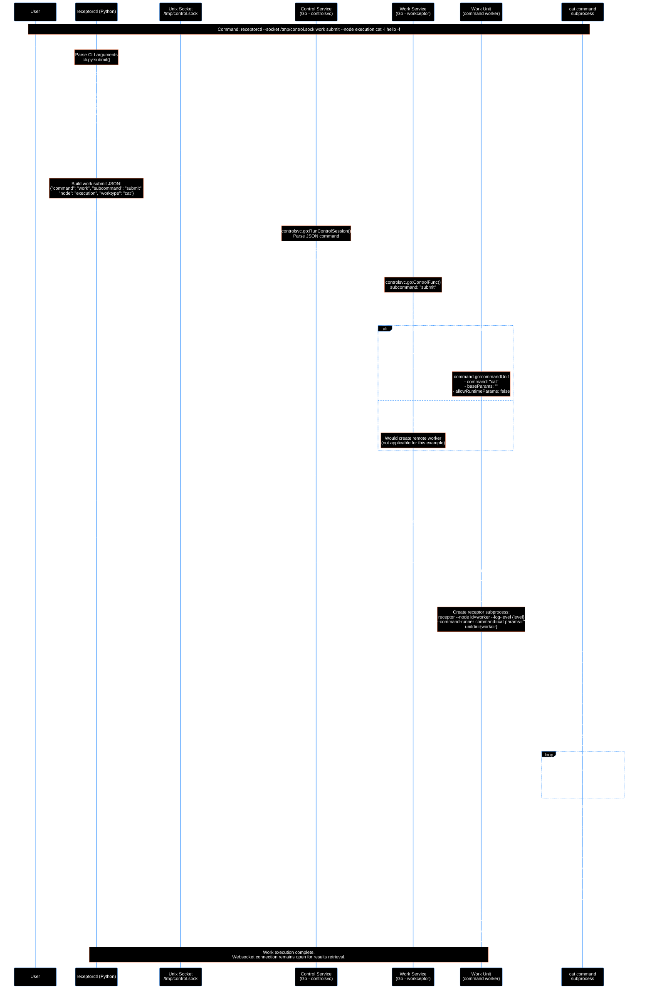
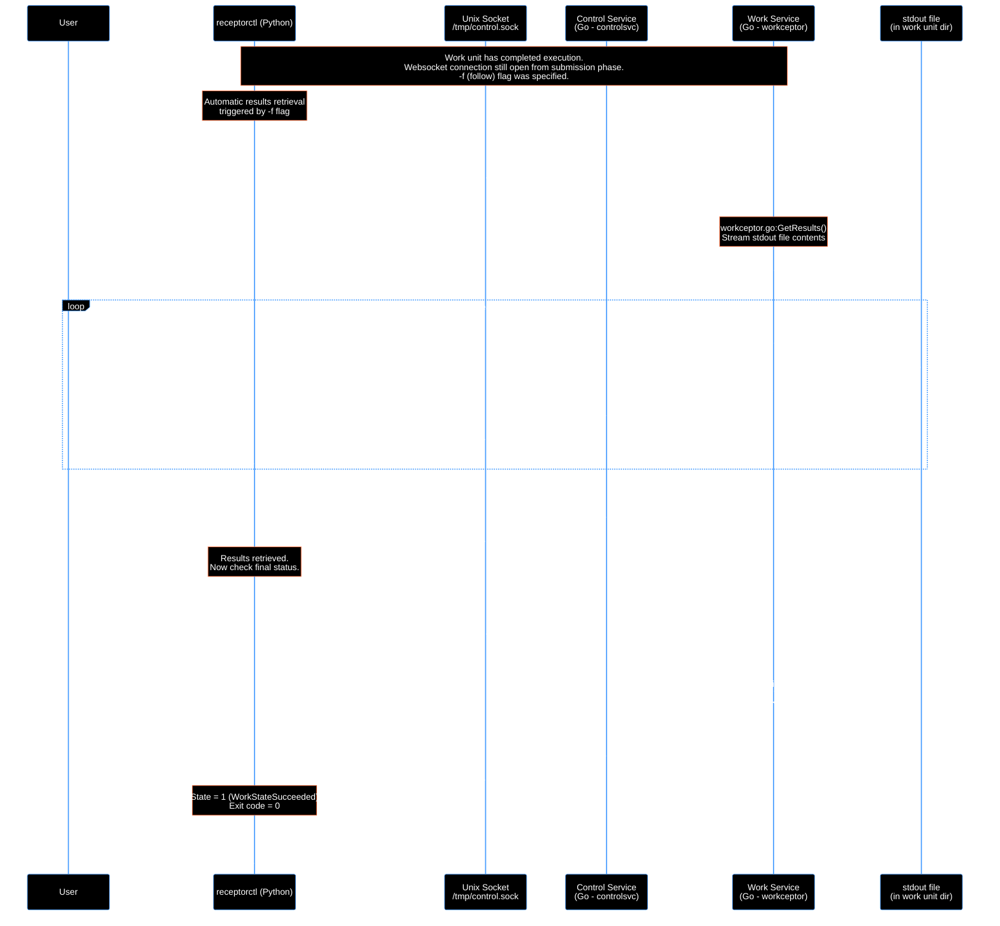

# Receptor Work Submit Flow Analysis

Based on the command: `receptorctl --socket /tmp/control.sock work submit --node execution cat -l hello -f`

This document provides a technical analysis of how Receptor executes work submissions. Receptor is a distributed mesh networking system used by Ansible Automation Platform (AAP) to execute tasks across multiple nodes. When you submit work (like running a command) to a remote execution node, this flow shows how it passes through 4 architectural layers (Python CLI → Control Service → Work Service → Command Worker) from submission to execution and results retrieval.
## Table of Contents

- [Command Breakdown](#command-breakdown)
- [Flow Diagrams](#flow-diagrams)
  - [Diagram 1: Work Submission Flow](#diagram-1-work-submission-flow)
  - [Diagram 2: Work Results Retrieval Flow](#diagram-2-work-results-retrieval-flow)
- [Key Components](#key-components)
- [Work States](#work-states)
- [Configuration](#configuration)
- [Developer Debugging Walkthrough](#developer-debugging-walkthrough)
  - [Prerequisites](#prerequisites)
  - [Breakpoint Locations](#breakpoint-locations)
    - [Diagram 1: Work Submission Flow Breakpoints](#diagram-1-work-submission-flow-breakpoints)
    - [Diagram 2: Work Results Retrieval Flow Breakpoints](#diagram-2-work-results-retrieval-flow-breakpoints)
  - [Debugging Steps with VSCode](#debugging-steps-with-vscode)
  - [Key Variables to Watch](#key-variables-to-watch)
  - [Log Analysis](#log-analysis)
## Command Breakdown

- `--socket /tmp/control.sock`: Connect to receptor control service via Unix socket
- `work submit`: Submit a new unit of work
- `--node execution`: Target the "execution" node for work execution
- `cat`: Work type (configured as a work-command that runs the `cat` command)
- `-l hello`: Literal payload "hello"
- `-f`: Follow the job and display results

## Flow Diagrams

### Diagram 1: Work Submission Flow

This diagram shows the complete flow of submitting work and executing it on the target node.



### Diagram 2: Work Results Retrieval Flow

This diagram shows how results are retrieved when the `-f` (follow) flag is used. The websocket connection from the submission phase remains open and is reused.



## Key Components

### 1. ReceptorCtl (Python)

- **File**: `receptorctl/receptorctl/cli.py`, `receptorctl/receptorctl/socket_interface.py`
- **Function**: Command-line interface and socket communication
- **Key Classes**: `ReceptorControl`, CLI command handlers

### 2. Control Service (Go)

- **File**: `pkg/controlsvc/controlsvc.go`
- **Function**: Protocol handler for control socket connections
- **Key Functions**: `RunControlSession()`, command routing

### 3. Work Service (Go)

- **File**: `pkg/workceptor/controlsvc.go`, `pkg/workceptor/workceptor.go`
- **Function**: Work unit management and execution
- **Key Functions**: `ControlFunc()`, `AllocateUnit()`, `Start()`

### 4. Command Worker (Go)

- **File**: `pkg/workceptor/command.go`
- **Function**: Executes shell commands as work units
- **Key Functions**: `Start()`, `commandRunner()`

## Work States

1. **WorkStatePending (0)**: Initial state, waiting to start
2. **WorkStateRunning (1)**: Currently executing
3. **WorkStateSucceeded (2)**: Completed successfully
4. **WorkStateFailed (3)**: Failed with error

## Configuration

The `cat` work type is configured via YAML:

```yaml
- work-command:
    workType: cat
    command: cat
```

This registers a command worker that executes the `cat` shell command when work of type "cat" is submitted.

## Developer Debugging Walkthrough

This section provides specific breakpoint locations and debugging steps to follow the code execution through the codebase.

### Prerequisites

- Set up your development environment with Go and Python debuggers
- Build receptor with debug symbols: `make build-dev` or `go build -gcflags="all=-N -l"`
- **Important**: Install receptorctl in editable/development mode so Python breakpoints work:

  ```bash
  cd receptorctl
  pip install -e .
  ```

  This creates a link to your source code instead of copying it, allowing the debugger to hit breakpoints in your workspace files.

### Breakpoint Locations

The breakpoints are organized by diagram to help you debug each flow independently.

#### Diagram 1: Work Submission Flow Breakpoints

##### 1. ReceptorCtl Entry Point

**File**: `receptorctl/receptorctl/cli.py`
**Function**: `submit()`

```python
def submit(
    ctx,
    worktype,
    node,
    payload,
    # ... other params
):
```

**What to observe**: CLI argument parsing, parameter validation

#### 2. Socket Connection Setup

**File**: `receptorctl/receptorctl/socket_interface.py`
**Function**: `connect()`

```python
def connect(self):
    if self._socket is not None:
        return
```

**What to observe**: Unix socket connection establishment

#### 3. Work Submission Request

**File**: `receptorctl/receptorctl/socket_interface.py`
**Function**: `submit_work()`

```python
def submit_work(
    self,
    worktype,
    payload,
    node=None,
    # ... other params
):
```

**What to observe**: JSON command construction, payload handling

#### 4. Control Service Session Handler

**File**: `pkg/controlsvc/controlsvc.go`
**Function**: `RunControlSession()`

```go
func (s *Server) RunControlSession(conn net.Conn) {
    s.nc.GetLogger().Debug("Client connected to control service %s\n", conn.RemoteAddr().String())
```

**What to observe**: Socket connection handling, command parsing

#### 5. JSON Command Processing

**File**: `pkg/controlsvc/controlsvc.go`
**Function**: `RunControlSession()` (command parsing section)

```go
if cmdBytes[0] == '{' {
    err := json.Unmarshal(cmdBytes, &jsonData)
```

**What to observe**: JSON unmarshaling, command extraction

#### 6. Work Command Routing

**File**: `pkg/controlsvc/controlsvc.go`
**Function**: `RunControlSession()` (command lookup section)

```go
s.controlFuncLock.RLock()
var ct ControlCommandType
for f := range s.controlTypes {
```

**What to observe**: Command type lookup, routing to work handler

#### 7. Work Command Handler Entry

**File**: `pkg/workceptor/controlsvc.go`
**Function**: `ControlFunc()`

```go
func (c *workceptorCommand) ControlFunc(ctx context.Context, nc controlsvc.NetceptorForControlCommand, cfo controlsvc.ControlFuncOperations) (map[string]interface{}, error) {
```

**What to observe**: Work command parameter extraction

#### 8. Work Submit Case Handler

**File**: `pkg/workceptor/controlsvc.go`
**Function**: `ControlFunc()` (submit case)

```go
case "submit":
    workNode, err := strFromMap(c.params, "node")
```

**What to observe**: Parameter extraction, node determination

#### 9. Local Work Unit Allocation

**File**: `pkg/workceptor/controlsvc.go`
**Function**: `ControlFunc()` (AllocateUnit call)

```go
worker, err = c.w.AllocateUnit(workType, workUnitID, workParams)
```

**What to observe**: Work unit creation decision (local vs remote)

#### 10. Work Unit Allocation Implementation

**File**: `pkg/workceptor/workceptor.go`
**Function**: `AllocateUnit()`

```go
func (w *Workceptor) AllocateUnit(workType string, workUnitID string, workParams map[string]string) (WorkUnit, error) {
```

**What to observe**: Work type lookup, worker factory invocation

#### 11. Command Worker Creation

**File**: `pkg/workceptor/command.go`
**Function**: `NewWorker()` (in CommandWorkerCfg)

```go
func (cfg CommandWorkerCfg) NewWorker(bwu BaseWorkUnitForWorkUnit, w *Workceptor, unitID string, workType string) WorkUnit {
```

**What to observe**: Command worker instantiation, parameter setup

#### 12. Stdin Data Handling

**File**: `pkg/workceptor/controlsvc.go`
**Function**: `ControlFunc()` (stdin handling)

```go
stdin, err := os.OpenFile(path.Join(worker.UnitDir(), "stdin"), os.O_CREATE+os.O_WRONLY, 0o600)
```

**What to observe**: Stdin file creation, data writing

#### 13. Work Unit Start

**File**: `pkg/workceptor/command.go`
**Function**: `Start()`

```go
func (cw *commandUnit) Start() error {
    level := cw.GetWorkceptor().nc.GetLogger().GetLogLevel()
```

**What to observe**: Command runner subprocess creation

#### 14. Command Runner Subprocess

**File**: `pkg/workceptor/command.go`
**Function**: `runCommand()`

```go
func (cw *commandUnit) runCommand(cmd *exec.Cmd) error {
    cmdSetDetach(cmd)
```

**What to observe**: Subprocess execution setup

#### 15. Command Runner Main Function

**File**: `pkg/workceptor/command.go`
**Function**: `commandRunner()`

```go
func commandRunner(command string, params string, unitdir string) error {
    status := StatusFileData{}
```

**What to observe**: Actual command execution, status updates

#### 16. Command Execution

**File**: `pkg/workceptor/command.go`
**Function**: `commandRunner()` (exec.Command section)

```go
var cmd *exec.Cmd
if params == "" {
    cmd = exec.Command(command)
```

**What to observe**: `cat` command execution

#### Diagram 2: Work Results Retrieval Flow Breakpoints

##### 1. Results Command Handler

**File**: `pkg/workceptor/controlsvc.go`
**Function**: `ControlFunc()` (results case)

```go
case "results":
    unitID, err := strFromMap(c.params, "unitid")
```

**What to observe**: Results command parameter extraction

##### 2. Results Streaming

**File**: `pkg/workceptor/workceptor.go`
**Function**: `GetResults()`

```go
func (w *Workceptor) GetResults(ctx context.Context, unitID string, startPos int64) (chan []byte, error) {
```

**What to observe**: Stdout file streaming, chunk reading

##### 3. Status Command Handler

**File**: `pkg/workceptor/controlsvc.go`
**Function**: `ControlFunc()` (status case)

```go
case "status":
    unitID, err := strFromMap(c.params, "unitid")
```

**What to observe**: Status file reading, response formatting

### Debugging Steps with VSCode

#### 1. Setup launch.json Configuration

Create or update `.vscode/launch.json` with the following configurations:

```json
{
  "version": "0.2.0",
  "configurations": [
    {
      "name": "Debug Receptor Control Node",
      "type": "go",
      "request": "launch",
      "mode": "debug",
      "program": "${workspaceFolder}/cmd/receptor-cl/receptor.go",
      "args": [
        "--config",
        "${workspaceFolder}/test-configs/control.yml"
      ],
      "env": {},
      "showLog": true
    },
    {
      "name": "Debug Receptor Execution Node",
      "type": "go",
      "request": "launch",
      "mode": "debug",
      "program": "${workspaceFolder}/cmd/receptor-cl/receptor.go",
      "args": [
        "--config",
        "${workspaceFolder}/test-configs/execution.yml"
      ],
      "env": {},
      "showLog": true
    },
    {
      "name": "Debug ReceptorCtl",
      "type": "debugpy",
      "request": "launch",
      "module": "receptorctl.cli",
      "cwd": "${workspaceFolder}/receptorctl",
      "args": [
        "--socket",
        "/tmp/control.sock",
        "work",
        "submit",
        "--node",
        "execution",
        "cat",
        "-l",
        "hello",
        "-f"
      ],
      "console": "integratedTerminal",
      "justMyCode": false,
      "env": {
        "PYTHONWARNINGS": "ignore::RuntimeWarning"
      }
    }
  ],
  "compounds": [
    {
      "name": "Debug Control + Execution Nodes",
      "configurations": [
        "Debug Receptor Control Node",
        "Debug Receptor Execution Node"
      ],
      "stopAll": true
    }
  ]
}
```

#### 2. Start Debugging

**Important**: Before debugging, ensure receptorctl is installed in editable mode (see Prerequisites above). This is required for Python breakpoints to work.

1. **Launch Both Nodes Together**:

   - Open VSCode Command Palette (Ctrl+Shift+P / Cmd+Shift+P)
   - Select "Debug: Select and Start Debugging"
   - Choose "Debug Control + Execution Nodes" compound configuration
   - Both receptor nodes will start with debugger attached
   - Wait for nodes to be ready (watch for "control service listening" in debug console)

2. **Set Breakpoints for Diagram 1 (Work Submission)**:

   **Python breakpoints:**
   - `receptorctl/receptorctl/cli.py` - `submit()` function
   - `receptorctl/receptorctl/socket_interface.py` - `submit_work()` function

   **Go breakpoints:**
   - `pkg/controlsvc/controlsvc.go` - `RunControlSession()`
   - `pkg/workceptor/controlsvc.go` - `ControlFunc()` (submit case)
   - `pkg/workceptor/workceptor.go` - `AllocateUnit()`
   - `pkg/workceptor/command.go` - `Start()`
   - `pkg/workceptor/command.go` - `commandRunner()`

3. **Set Breakpoints for Diagram 2 (Results Retrieval)**:

   **Python breakpoints:**
   - `receptorctl/receptorctl/socket_interface.py` - Results retrieval code (after work submission)

   **Go breakpoints:**
   - `pkg/workceptor/controlsvc.go` - `ControlFunc()` (results case)
   - `pkg/workceptor/workceptor.go` - `GetResults()`
   - `pkg/workceptor/controlsvc.go` - `ControlFunc()` (status case)

4. **Debug ReceptorCtl Client**:

   - After receptor nodes are running and ready, start the Python debugger
   - Select "Debug ReceptorCtl" configuration from the debug dropdown
   - The command will execute and hit breakpoints in both flows sequentially

5. **Step Through Execution**:

   - Use VSCode debug controls (Continue, Step Over, Step Into, Step Out)
   - Watch the call stack across both Go processes
   - Inspect variables in the Debug sidebar
   - Observe the data flow:
     - **First flow**: Submission → Execution → Completion
     - **Second flow**: Results retrieval → Status check → Exit

### Key Variables to Watch

- **In receptorctl**: `worktype`, `node`, `payload_data`, `commandMap`
- **In control service**: `cmdBytes`, `jsonData`, `cmd`, `params`
- **In work service**: `workNode`, `workType`, `workParams`, `worker`
- **In command worker**: `cw.command`, `cw.baseParams`, `cmd`
- **In command runner**: `command`, `params`, `unitdir`, `status`

### Log Analysis

Enable debug logging to see the full flow:
Look for these log patterns:
```bash
# "Client connected to control service"
# "Work unit created with ID"
# "Running: PID"
# "Streaming results for work unit"
This walkthrough allows developers to trace the complete execution path from CLI input to command execution and result output.


### Related Documentation

- [AWX to Receptor Integration Flow](awx_receptor_integration.md) - Complete walkthrough of how AWX uses Receptor for job execution
- [AWX Job Execution Walkthrough](https://gist.github.com/fosterseth/f0966ac6e214099ce28be5b154fd8f5b) - Detailed AWX-side flow from API to ansible-playbook

### Official Receptor Documentation

- [Receptor GitHub Repository](https://github.com/ansible/receptor) - Source code and development information
- [Receptor Documentation](https://receptor.readthedocs.io/) - Official documentation for Receptor
- [Receptor User Guide](https://receptor.readthedocs.io/en/latest/user_guide/) - Usage and configuration guides

### Ansible Automation Platform Documentation

- [Ansible Automation Platform - Receptor Overview](https://docs.ansible.com/automation-controller/latest/html/administration/receptor.html) - Receptor in Automation Controller context
- [Ansible Automation Platform - Mesh Topology](https://docs.ansible.com/automation-controller/latest/html/administration/topology.html) - Understanding mesh networking with Receptor
- [Ansible Automation Platform Installation Guide](https://docs.ansible.com/automation-controller/latest/html/installerguide/index.html) - Installation and setup

### Technical Resources

- [Receptor Work System](https://receptor.readthedocs.io/en/latest/user_guide/workceptor.html) - Detailed work submission documentation
- [Receptor Control Service](https://receptor.readthedocs.io/en/latest/user_guide/controlsvc.html) - Control service API reference
- [ReceptorCtl Command Reference](https://receptor.readthedocs.io/en/latest/receptorctl/) - Command-line tool documentation

### Community and Support

- [Ansible Community Forum](https://forum.ansible.com/) - Community discussions and support
- [Receptor Issues](https://github.com/ansible/receptor/issues) - Bug reports and feature requests
- [Ansible AWX Project](https://github.com/ansible/awx) - Related project that uses Receptor
