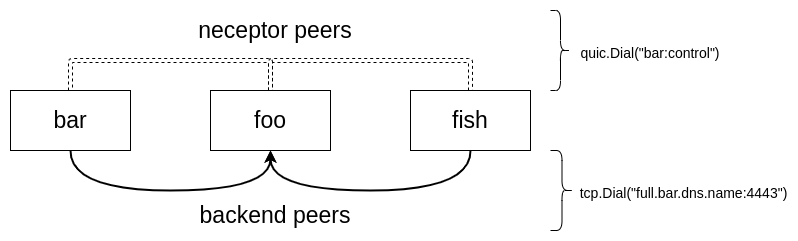

Connecting nodes
================

Connect nodes via receptor backends. TCP, UDP, and websockets are currently supported. For example, ``tcp-peer`` can be used to connect to another node's ``tcp-listener``, and ``ws-peer`` can be used to connect to another node's ``ws-listener``.

foo.yml

.. code-block:: yaml

    ---
    - node:
        id: foo

    - log-level:
        level: Debug

    - tcp-listener:
        port: 2222

bar.yml

.. code-block:: yaml

    ---
    - node:
        id: bar

    - log-level:
        level: Debug

    - tcp-peer:
        address: localhost:2222

fish.yml

.. code-block:: yaml

    ---
    - node:
        id: fish

    - log-level:
        level: Debug

    - tcp-peer:
        address: localhost:2222

If we start the backends for each of these configurations, this will form a three-node mesh. Notice `bar` and `fish` are not directly connected to each other. However, the mesh allows traffic from `bar` to pass through `foo` to reach `fish`, as if `bar` and `fish` were directly connected.

From three terminals we can start this example by using the container we provide on quay.io

.. code::

    podman run -it --rm --network host --name foo -v${PWD}/foo.yml:/etc/receptor/receptor.conf quay.io/ansible/receptor

.. code::

    podman run -it --rm --network host --name bar -v${PWD}/bar.yml:/etc/receptor/receptor.conf quay.io/ansible/receptor

.. code::

    podman run -it --rm --network host --name fish -v${PWD}/fish.yml:/etc/receptor/receptor.conf quay.io/ansible/receptor

Logs from `fish` shows a successful connection to `bar` via `foo`.

.. code::

    INFO 2021/07/22 23:04:31 Known Connections:
    INFO 2021/07/22 23:04:31    fish: foo(1.00)
    INFO 2021/07/22 23:04:31    foo: bar(1.00) fish(1.00)
    INFO 2021/07/22 23:04:31    bar: foo(1.00)
    INFO 2021/07/22 23:04:31 Routing Table:
    INFO 2021/07/22 23:04:31    foo via foo
    INFO 2021/07/22 23:04:31    bar via foo

Configuring backends
^^^^^^^^^^^^^^^^^^^^

``redial`` If set to true, receptor will automatically attempt to redial and restore connections that are lost.

``cost``  User-defined metric that will be used by the mesh routing algorithm. If the mesh were represented by a graph node, then cost would be the length or weight of the edges between nodes. When the routing algorithm determines how to pass network packets from one node to another, it will use this cost to determine an efficient path.

``nodecost`` Cost to a particular node on the mesh, and overrides whatever is set in ``cost``.

in foo.yml

.. code::

    - tcp-listener:
        port: 2222
        cost: 1.0
        nodecost:
            bar: 1.6
            fish: 2.0

This means packets sent to `fish` have a cost of 2.0, whereas packets sent to `bar` have a cost of 1.6. If `haz` joined the mesh, it would get a cost of 1.0 since it's not in the nodecost map.

The costs on the two ends of the connection must match. For example, the ``tcp-peer`` on `fish` must have a cost of 2.0, otherwise the connection will be refused.

in fish.yml

.. code::

    - tcp-peer:
        address: localhost:2222
        cost: 2.0
