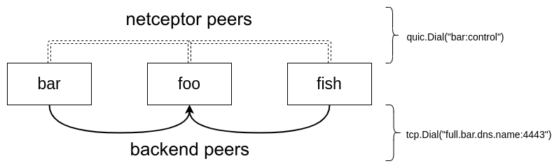

+++++++++++++++++++++++++++++
Getting started with Receptor
+++++++++++++++++++++++++++++

Receptor is an overlay network intended to ease the distribution of work across
a large and dispersed collection of workers. Receptor nodes establish peer-to-
peer connections with each other via existing networks. Once connected, the re-
ceptor mesh provides datagram (UDP-like) and stream (TCP-like) capabilities to
applications, as well as robust unit-of-work handling with resiliency against
transient network failures.

.. toctree::
    :maxdepth: 1
    :caption: Contents:

    introduction
    installing_receptor
    creating_a_basic_network
    trying_sample_commands

.. seealso::

    :ref:`glossary`
        Receptor glossary
    :ref: `Interacting with nodes <https://ansible.readthedocs.io/projects/receptor/en/latest/user_guide/interacting_with_nodes.html>`
        Further examples of working with nodes
    :ref: `Connecting nodes<https://ansible.readthedocs.io/projects/receptor/en/latest/user_guide/connecting_nodes.html>`_
        Detail on connecting receptor nodes
