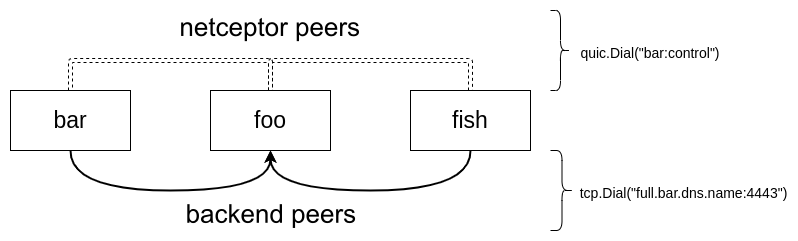

.. _connecting_nodes:

Connecting nodes
================

.. contents::
   :local:

Connect nodes through Receptor backends.
TCP, UDP, and WebSockets are the supported backend transports.
These backends are not the mesh protocol itself — they are the underlying carrier over which Receptor runs QUIC.
QUIC provides the encrypted, multiplexed streams that the mesh protocol uses to route traffic between nodes.

.. list-table:: Backend transports
   :widths: 15 85
   :header-rows: 1

   * - Backend
     - When to use
   * - UDP
     - Default choice. QUIC was designed for UDP, so this is the most direct path.
   * - TCP
     - Use when firewalls or network policy block UDP. QUIC frames are carried inside the TCP stream.
   * - WebSocket
     - Use when only HTTP/HTTPS traffic is allowed out (e.g. corporate proxies). QUIC frames are tunneled over a WebSocket connection.

For example, you can connect one Receptor node to another using the ``tcp-peers`` and ``tcp-listeners`` configuration options.
Similarly you can connect Receptor nodes using the ``ws-peers`` and ``ws-listeners`` configuration options.

UDP example (control → hop → execution)
-----------------------------------------

The following three-node example uses UDP as the backend transport.
``control`` is the root listener; ``hop`` connects to ``control`` and also listens for additional peers;
``execution`` connects only to ``hop`` and reaches ``control`` through it.

udp-control.yml

.. tab-set::

   .. tab-item:: Version 2

      .. code-block:: yaml

         ---
         version: 2

         node:
           id: control

         log-level:
           level: info

         control-services:
           - service: control
             tcplisten: "127.0.0.1:7323"

         udp-listeners:
           - port: 2223

   .. tab-item:: Version 1

      .. code-block:: yaml

         ---
         - node:
            id: control

         - log-level: info

         - control-service:
            service: control
            tcplisten: "127.0.0.1:7323"

         - udp-listener:
            port: 2223

udp-hop.yml

.. tab-set::

   .. tab-item:: Version 2

      .. code-block:: yaml

         ---
         version: 2

         node:
           id: hop

         log-level:
           level: info

         control-services:
           - service: control
             tcplisten: "127.0.0.1:7324"

         udp-listeners:
           - port: 2224

         udp-peers:
           - address: localhost:2223

   .. tab-item:: Version 1

      .. code-block:: yaml

         ---
         - node:
            id: hop

         - log-level: info

         - control-service:
            service: control
            tcplisten: "127.0.0.1:7324"

         - udp-listener:
            port: 2224

         - udp-peer:
            address: localhost:2223

udp-execution.yml

.. tab-set::

   .. tab-item:: Version 2

      .. code-block:: yaml

         ---
         version: 2

         node:
           id: execution

         log-level:
           level: info

         control-services:
           - service: control
             tcplisten: "127.0.0.1:7325"

         udp-peers:
           - address: localhost:2224

         work-commands:
           - worktype: bash
             command: bash

   .. tab-item:: Version 1

      .. code-block:: yaml

         ---
         - node:
            id: execution

         - log-level: info

         - control-service:
            service: control
            tcplisten: "127.0.0.1:7325"

         - udp-peer:
            address: localhost:2224

         - work-command:
            worktype: bash
            command: bash

Start each node in a separate terminal:

.. tab-set::

   .. tab-item:: Version 2

      .. code-block:: bash

         receptor --config-v2 --config udp-control.yml
         receptor --config-v2 --config udp-hop.yml
         receptor --config-v2 --config udp-execution.yml

   .. tab-item:: Version 1

      .. code-block:: bash

         receptor --config udp-control.yml
         receptor --config udp-hop.yml
         receptor --config udp-execution.yml

Verify the mesh from any node using ``receptorctl`` over its TCP control socket:

.. code-block:: bash

    receptorctl --socket tcp://127.0.0.1:7323 status

The routing table should show all three nodes. ``execution`` reaches ``control`` via ``hop``.

TCP example (foo → bar, foo → fish)
--------------------------------------

The following example uses TCP as the backend transport instead.
This is useful when UDP is blocked by a firewall.

foo.yml

.. tab-set::

   .. tab-item:: Version 2

      .. code-block:: yaml

         ---
         version: 2
         node:
           id: foo

         log-level:
           level: Debug

         tcp-listeners:
           - port: 2222

   .. tab-item:: Version 1

      .. code-block:: yaml

         ---
         - node:
            id: foo

         - log-level: Debug

         - tcp-listener:
            port: 2222

bar.yml

.. tab-set::

   .. tab-item:: Version 2

      .. code-block:: yaml

         ---
         version: 2
         node:
           id: bar

         log-level:
           level: Debug

         tcp-peers:
           - address: localhost:2222

   .. tab-item:: Version 1

      .. code-block:: yaml

         ---
         - node:
            id: bar

         - log-level: Debug

         - tcp-peer:
            address: localhost:2222

fish.yml

.. tab-set::

   .. tab-item:: Version 2

      .. code-block:: yaml

         ---
         version: 2
         node:
           id: fish

         log-level:
           level: Debug

         tcp-peers:
           - address: localhost:2222

   .. tab-item:: Version 1

      .. code-block:: yaml

         ---
         - node:
            id: fish

         - log-level: Debug

         - tcp-peer:
            address: localhost:2222

If we start the backends for each of these configurations, this will form a three-node mesh. Notice `bar` and `fish` are not directly connected to each other. However, the mesh allows traffic from `bar` to pass through `foo` to reach `fish`, as if `bar` and `fish` were directly connected.

From three terminals we can start this example by using the container we provide on quay.io

.. code-block:: bash

    podman run -it --rm --network host --name foo -v${PWD}/foo.yml:/etc/receptor/receptor.conf quay.io/ansible/receptor

.. code-block:: bash

    podman run -it --rm --network host --name bar -v${PWD}/bar.yml:/etc/receptor/receptor.conf quay.io/ansible/receptor

.. code-block:: bash

    podman run -it --rm --network host --name fish -v${PWD}/fish.yml:/etc/receptor/receptor.conf quay.io/ansible/receptor

Logs from `fish` shows a successful connection to `bar` via `foo`.

.. code-block:: text

    INFO 2021/07/22 23:04:31 Known Connections:
    INFO 2021/07/22 23:04:31    fish: foo(1.00)
    INFO 2021/07/22 23:04:31    foo: bar(1.00) fish(1.00)
    INFO 2021/07/22 23:04:31    bar: foo(1.00)
    INFO 2021/07/22 23:04:31 Routing Table:
    INFO 2021/07/22 23:04:31    foo via foo
    INFO 2021/07/22 23:04:31    bar via foo

Configuring backends
--------------------

``redial`` If set to true, receptor will automatically attempt to redial and restore connections that are lost.

``cost``  User-defined metric that will be used by the mesh routing algorithm. If the mesh were represented by a graph node, then cost would be the length or weight of the edges between nodes. When the routing algorithm determines how to pass network packets from one node to another, it will use this cost to determine an efficient path.

``nodecost`` Cost to a particular node on the mesh, and overrides whatever is set in ``cost``.

in foo.yml

.. code-block:: yaml

    tcp-listeners:
      - port: 2222
        cost: 1.0
        nodecost:
          bar: 1.6
          fish: 2.0

This means packets sent to `fish` have a cost of 2.0, whereas packets sent to `bar` have a cost of 1.6. If `haz` joined the mesh, it would get a cost of 1.0 since it's not in the nodecost map.

The costs on both ends of the connection must match.
For example, the ``tcp-peers`` configuration on ``fish`` must have a cost of ``2.0``, otherwise the connection will be refused.

in fish.yml

.. code-block:: yaml

    tcp-peers:
      - address: localhost:2222
        cost: 2.0
