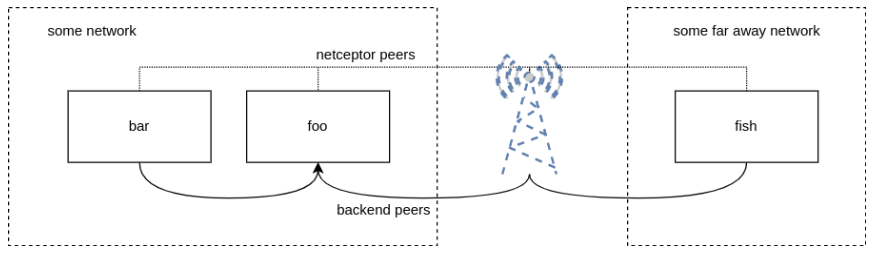

Support for Edge Networks
=========================

Recptor out-of-the-box has the ability to support complicated networking environments including edge networks.

.. contents::
   :local:

Consider the following environment:

Configurable-Items
-------------------

Receptor encapsulates the concepts of `below-the-mesh` and `above-the-mesh` connections. Please refer to :doc:`tls` for a better understanding of these networking layers.

If a particular node in a network has higher than normal latency, we allow the users to define a finely-grained idle connection timeout value for any given Receptor node. This will help Receptor keep `below-the-mesh` tcp connections alive. Receptor will monitor backend connections for traffic and will timeout any connection that hasn't seen traffic for a period of time. Once the connection is dropped, a new connection is formed automatically.

If a connection timeout occurs, the users can expect to see a message like this in their receptor logs.

.. code::

    DEBUG 2022/04/07 12:48:56 Sending initial connection message
    ERROR 2022/04/07 12:48:56 Backend sending error read tcp 10.26.5    0.239:27199->10.102.21.131:35024: i/o **timeout**

To circumvent this scenario from happening, users can leverage the `maxidleconnectiontimeout` parameter in their configuration files.

`maxidleconnectiontimeout` A user-defined parameter in the configuration file that will set the `below-the-mesh` tcp connection timeout.

The configuration files for the diagram above are listed below.

foo.yml

.. code-block:: yaml

    ---
    - node:
        id: foo
        maxidleconnectiontimeout: 60s
    - log-level:
        level: Debug
    - tcp-listener:
        port: 2222

bar.yml

.. code-block:: yaml

    ---
    - node:
        id: bar
        maxidleconnectiontimeout: 60s
    - log-level:
        level: Debug
    - tcp-peer:
        address: localhost:2222

fish.yml

.. code-block:: yaml

    ---
    - node:
        id: fish
        maxidleconnectiontimeout: 60s
    - log-level:
        level: Debug
    - tcp-peer:
        address: localhost:2222

*Note* - All Receptor nodes in the mesh must define a `maxidleconnectiontimeout` value, if this value is consumed on ANY node. The effective `maxidleconnectiontimeout` value is the minumum value between all the nodes in the mesh.
