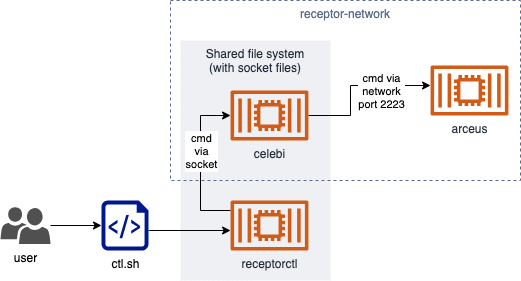

# receptor - basic example

This example creates two receptor nodes, called `arceus` and `celebi`.

## Diagram

The `ctl.sh` script (equivalent to `receptorctl`) sends the message to Celebi through an unix domain socket `socks/celebi.sock`, then Celebi forwards that message to Arceus through the docker-compose network.



## Commands

```bash
# Build and run
docker-compose up -d

# Destroy and cleanup
docker-compose down
rm -rf ./socks/

# Run commands on receptorctl
./ctl.sh <args>

# Examples
./ctl.sh ping celebi
./ctl.sh ping arceus
./ctl.sh work submit echo --node arceus --no-payload -f
```

## Config files

Celebi socket is exposed:

Full Celebi config file can be found here: [configs/celebi.yaml](configs/celebi.yaml)

```yaml
...

- control-service:
    service: control
    filename: /socks/celebi.sock
```

Arceus port is exposed:

Full Arceus config file can be found here: [configs/arceus.yaml](configs/arceus.yaml)

```yaml
...

- tcp-listener:
    port: 2223

...
```
